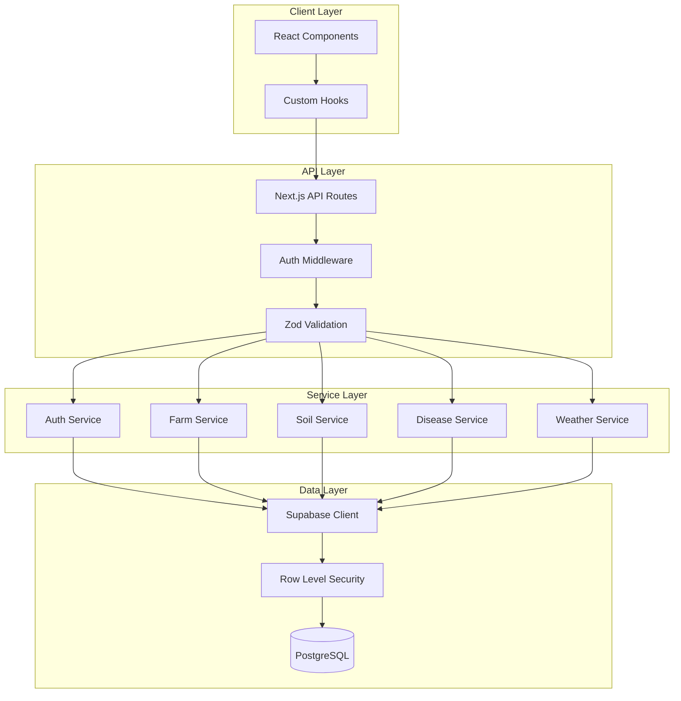
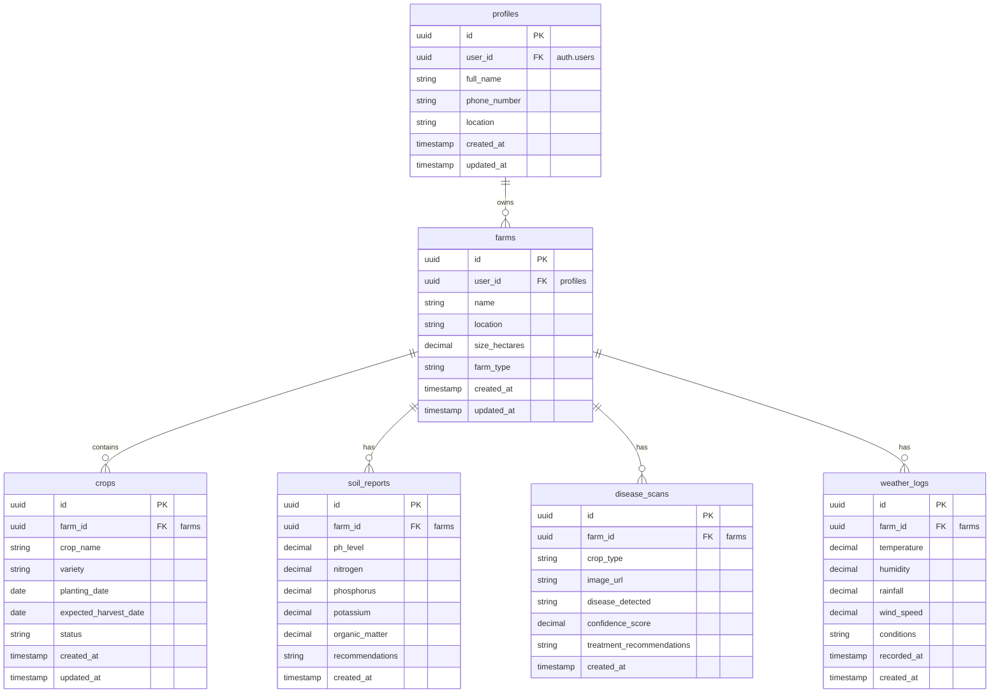
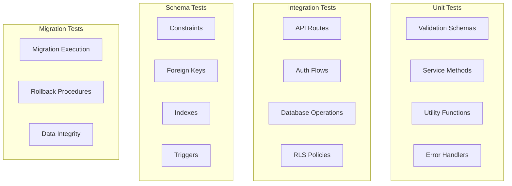

# Design Document: Kulima AgriTech Backend Foundation

## Overview

The Kulima AgriTech platform backend foundation establishes a production-ready, scalable, and secure architecture for an African agricultural technology platform. This design addresses the complete backend rebuild while ensuring zero data loss and maintaining compatibility with the existing PostgreSQL database.

### Design Goals

1. **Database Safety First**: Implement comprehensive schema inspection, versioned migrations, and rollback capabilities before any schema modifications
2. **Security by Default**: Enforce Row Level Security (RLS), proper authentication, and environment variable separation
3. **Type Safety**: Leverage TypeScript strict mode and generated database types throughout the stack
4. **Clean Architecture**: Establish clear separation of concerns with service layer, feature modules, and API contracts
5. **Developer Experience**: Provide reusable hooks, comprehensive documentation, and consistent patterns
6. **Performance**: Optimize queries with indexes, pagination, and connection pooling
7. **Maintainability**: Keep modules focused, avoid duplication, and follow single responsibility principle

### Technology Stack

- **Frontend Framework**: Next.js 14+ (App Router), React 18+, TypeScript 5+
- **Styling**: Tailwind CSS
- **Backend**: Next.js API Routes (TypeScript)
- **Database**: PostgreSQL 15+ via Supabase
- **Authentication**: Supabase Auth
- **Validation**: Zod
- **Type Generation**: Supabase CLI
- **Development**: Node.js 18+, npm/yarn

### Key Design Principles

1. **Never Break the Database**: All schema changes go through versioned migrations with documented rollback plans
2. **Service Layer Abstraction**: Components never directly query the database; all data access goes through service methods
3. **Type-Driven Development**: Generate types from schema, validate at runtime with Zod, enforce with TypeScript strict mode
4. **Feature-Based Organization**: Group related code by domain (farms, soil, disease, weather) rather than by technical layer
5. **Security in Depth**: RLS at database level, authentication middleware at route level, input validation at API boundary
6. **Explicit Over Implicit**: Clear API contracts, typed interfaces, documented behavior


## Architecture

### System Architecture Overview

The Kulima platform follows a layered architecture with clear separation between presentation, business logic, and data access:



### Folder Structure

```
kulima/
├── src/
│   ├── app/                          # Next.js App Router
│   │   ├── (auth)/                   # Auth route group
│   │   │   ├── login/
│   │   │   └── signup/
│   │   ├── (dashboard)/              # Protected route group
│   │   │   ├── farms/
│   │   │   ├── soil/
│   │   │   ├── disease/
│   │   │   └── weather/
│   │   ├── api/                      # API Routes
│   │   │   ├── auth/
│   │   │   │   ├── signup/route.ts
│   │   │   │   ├── login/route.ts
│   │   │   │   └── logout/route.ts
│   │   │   ├── farms/
│   │   │   │   ├── route.ts          # GET /api/farms, POST /api/farms
│   │   │   │   └── [id]/route.ts     # GET/PUT/DELETE /api/farms/:id
│   │   │   ├── soil-reports/
│   │   │   │   ├── route.ts
│   │   │   │   └── [id]/route.ts
│   │   │   ├── disease-scans/
│   │   │   │   ├── route.ts
│   │   │   │   └── [id]/route.ts
│   │   │   └── weather-logs/
│   │   │       ├── route.ts
│   │   │       └── [id]/route.ts
│   │   ├── layout.tsx
│   │   ├── page.tsx
│   │   └── middleware.ts             # Auth middleware
│   │
│   ├── features/                     # Feature modules
│   │   ├── auth/
│   │   │   ├── components/
│   │   │   │   ├── LoginForm.tsx
│   │   │   │   └── SignupForm.tsx
│   │   │   ├── hooks/
│   │   │   │   ├── useAuth.ts
│   │   │   │   └── useSession.ts
│   │   │   ├── services/
│   │   │   │   └── auth.service.ts
│   │   │   ├── types/
│   │   │   │   └── auth.types.ts
│   │   │   └── validation/
│   │   │       └── auth.schema.ts
│   │   ├── farms/
│   │   │   ├── components/
│   │   │   │   ├── FarmCard.tsx
│   │   │   │   ├── FarmForm.tsx
│   │   │   │   └── FarmList.tsx
│   │   │   ├── hooks/
│   │   │   │   ├── useFarms.ts
│   │   │   │   ├── useCreateFarm.ts
│   │   │   │   └── useUpdateFarm.ts
│   │   │   ├── services/
│   │   │   │   └── farm.service.ts
│   │   │   ├── types/
│   │   │   │   └── farm.types.ts
│   │   │   └── validation/
│   │   │       └── farm.schema.ts
│   │   ├── soil/
│   │   │   ├── components/
│   │   │   ├── hooks/
│   │   │   ├── services/
│   │   │   │   └── soil.service.ts
│   │   │   ├── types/
│   │   │   │   └── soil.types.ts
│   │   │   └── validation/
│   │   │       └── soil.schema.ts
│   │   ├── disease-detection/
│   │   │   ├── components/
│   │   │   ├── hooks/
│   │   │   ├── services/
│   │   │   │   └── disease.service.ts
│   │   │   ├── types/
│   │   │   │   └── disease.types.ts
│   │   │   └── validation/
│   │   │       └── disease.schema.ts
│   │   └── weather/
│   │       ├── components/
│   │       ├── hooks/
│   │       ├── services/
│   │       │   └── weather.service.ts
│   │       ├── types/
│   │       │   └── weather.types.ts
│   │       └── validation/
│   │           └── weather.schema.ts
│   │
│   ├── lib/                          # Third-party library configuration
│   │   ├── supabase/
│   │   │   ├── client.ts             # Client-side Supabase client
│   │   │   ├── server.ts             # Server-side Supabase client
│   │   │   └── middleware.ts         # Middleware Supabase client
│   │   └── database.types.ts         # Generated database types
│   │
│   ├── server/                       # Server-only code
│   │   ├── db/
│   │   │   └── connection.ts         # Database connection pooling
│   │   └── utils/
│   │       └── server-helpers.ts
│   │
│   ├── types/                        # Shared types
│   │   ├── api.types.ts              # API request/response types
│   │   ├── common.types.ts           # Common utility types
│   │   └── index.ts
│   │
│   ├── utils/                        # Shared utilities
│   │   ├── error-handler.ts          # Centralized error handling
│   │   ├── logger.ts                 # Logging utility
│   │   ├── pagination.ts             # Pagination helpers
│   │   └── validators.ts             # Common validators
│   │
│   └── config/                       # Configuration
│       ├── env.ts                    # Environment variable validation
│       └── constants.ts              # Application constants
│
├── supabase/
│   ├── migrations/                   # Database migrations
│   │   ├── 20240101000000_initial_schema.sql
│   │   ├── 20240102000000_add_indexes.sql
│   │   └── ...
│   ├── seed.sql                      # Seed data
│   └── config.toml                   # Supabase configuration
│
├── .env.local                        # Local environment variables
├── .env.example                      # Environment variable template
├── next.config.js
├── tsconfig.json
├── package.json
└── README.md
```

### Architecture Layers

#### 1. Presentation Layer (React Components)
- **Responsibility**: UI rendering, user interaction, local state management
- **Rules**: 
  - Never directly call Supabase or database
  - Use custom hooks for data fetching
  - Handle loading and error states
  - Keep components focused and under 200 lines

#### 2. Hook Layer (Custom React Hooks)
- **Responsibility**: Data fetching, mutations, client-side state management
- **Rules**:
  - Call API routes, not services directly
  - Handle loading, error, and success states
  - Implement optimistic updates for mutations
  - Provide type-safe interfaces

#### 3. API Layer (Next.js API Routes)
- **Responsibility**: HTTP request handling, authentication, validation, response formatting
- **Rules**:
  - Validate authentication via middleware
  - Validate request body with Zod schemas
  - Call service layer methods
  - Return consistent JSON responses
  - Handle errors with centralized error handler

#### 4. Service Layer (Business Logic)
- **Responsibility**: Business logic, database operations, data transformation
- **Rules**:
  - Encapsulate all database queries
  - Validate ownership and permissions
  - Transform database records to domain types
  - Handle database errors
  - Return typed results

#### 5. Data Layer (Supabase/PostgreSQL)
- **Responsibility**: Data persistence, RLS enforcement, referential integrity
- **Rules**:
  - Enforce RLS on all user tables
  - Maintain foreign key constraints
  - Use indexes for performance
  - Validate data types and constraints


## Components and Interfaces

### Database Schema

#### Entity Relationship Diagram



#### Table Definitions

##### profiles Table
```sql
CREATE TABLE profiles (
    id UUID PRIMARY KEY DEFAULT gen_random_uuid(),
    user_id UUID NOT NULL REFERENCES auth.users(id) ON DELETE CASCADE,
    full_name TEXT NOT NULL,
    phone_number TEXT,
    location TEXT,
    created_at TIMESTAMPTZ NOT NULL DEFAULT NOW(),
    updated_at TIMESTAMPTZ NOT NULL DEFAULT NOW(),
    UNIQUE(user_id)
);

-- Enable RLS
ALTER TABLE profiles ENABLE ROW LEVEL SECURITY;

-- RLS Policies
CREATE POLICY "Users can view own profile"
    ON profiles FOR SELECT
    USING (auth.uid() = user_id);

CREATE POLICY "Users can update own profile"
    ON profiles FOR UPDATE
    USING (auth.uid() = user_id);

CREATE POLICY "Users can insert own profile"
    ON profiles FOR INSERT
    WITH CHECK (auth.uid() = user_id);

-- Indexes
CREATE INDEX idx_profiles_user_id ON profiles(user_id);

-- Updated_at trigger
CREATE OR REPLACE FUNCTION update_updated_at_column()
RETURNS TRIGGER AS $$
BEGIN
    NEW.updated_at = NOW();
    RETURN NEW;
END;
$$ LANGUAGE plpgsql;

CREATE TRIGGER update_profiles_updated_at
    BEFORE UPDATE ON profiles
    FOR EACH ROW
    EXECUTE FUNCTION update_updated_at_column();
```

##### farms Table
```sql
CREATE TABLE farms (
    id UUID PRIMARY KEY DEFAULT gen_random_uuid(),
    user_id UUID NOT NULL REFERENCES profiles(user_id) ON DELETE CASCADE,
    name TEXT NOT NULL,
    location TEXT NOT NULL,
    size_hectares DECIMAL(10, 2),
    farm_type TEXT,
    created_at TIMESTAMPTZ NOT NULL DEFAULT NOW(),
    updated_at TIMESTAMPTZ NOT NULL DEFAULT NOW(),
    CONSTRAINT valid_size CHECK (size_hectares > 0)
);

-- Enable RLS
ALTER TABLE farms ENABLE ROW LEVEL SECURITY;

-- RLS Policies
CREATE POLICY "Users can view own farms"
    ON farms FOR SELECT
    USING (auth.uid() = user_id);

CREATE POLICY "Users can insert own farms"
    ON farms FOR INSERT
    WITH CHECK (auth.uid() = user_id);

CREATE POLICY "Users can update own farms"
    ON farms FOR UPDATE
    USING (auth.uid() = user_id);

CREATE POLICY "Users can delete own farms"
    ON farms FOR DELETE
    USING (auth.uid() = user_id);

-- Indexes
CREATE INDEX idx_farms_user_id ON farms(user_id);
CREATE INDEX idx_farms_created_at ON farms(created_at DESC);

-- Updated_at trigger
CREATE TRIGGER update_farms_updated_at
    BEFORE UPDATE ON farms
    FOR EACH ROW
    EXECUTE FUNCTION update_updated_at_column();
```

##### crops Table
```sql
CREATE TABLE crops (
    id UUID PRIMARY KEY DEFAULT gen_random_uuid(),
    farm_id UUID NOT NULL REFERENCES farms(id) ON DELETE CASCADE,
    crop_name TEXT NOT NULL,
    variety TEXT,
    planting_date DATE,
    expected_harvest_date DATE,
    status TEXT DEFAULT 'planted',
    created_at TIMESTAMPTZ NOT NULL DEFAULT NOW(),
    updated_at TIMESTAMPTZ NOT NULL DEFAULT NOW(),
    CONSTRAINT valid_harvest_date CHECK (expected_harvest_date >= planting_date)
);

-- Enable RLS
ALTER TABLE crops ENABLE ROW LEVEL SECURITY;

-- RLS Policies
CREATE POLICY "Users can view crops from own farms"
    ON crops FOR SELECT
    USING (
        EXISTS (
            SELECT 1 FROM farms
            WHERE farms.id = crops.farm_id
            AND farms.user_id = auth.uid()
        )
    );

CREATE POLICY "Users can insert crops to own farms"
    ON crops FOR INSERT
    WITH CHECK (
        EXISTS (
            SELECT 1 FROM farms
            WHERE farms.id = crops.farm_id
            AND farms.user_id = auth.uid()
        )
    );

CREATE POLICY "Users can update crops in own farms"
    ON crops FOR UPDATE
    USING (
        EXISTS (
            SELECT 1 FROM farms
            WHERE farms.id = crops.farm_id
            AND farms.user_id = auth.uid()
        )
    );

CREATE POLICY "Users can delete crops from own farms"
    ON crops FOR DELETE
    USING (
        EXISTS (
            SELECT 1 FROM farms
            WHERE farms.id = crops.farm_id
            AND farms.user_id = auth.uid()
        )
    );

-- Indexes
CREATE INDEX idx_crops_farm_id ON crops(farm_id);
CREATE INDEX idx_crops_planting_date ON crops(planting_date DESC);

-- Updated_at trigger
CREATE TRIGGER update_crops_updated_at
    BEFORE UPDATE ON crops
    FOR EACH ROW
    EXECUTE FUNCTION update_updated_at_column();
```

##### soil_reports Table
```sql
CREATE TABLE soil_reports (
    id UUID PRIMARY KEY DEFAULT gen_random_uuid(),
    farm_id UUID NOT NULL REFERENCES farms(id) ON DELETE CASCADE,
    ph_level DECIMAL(3, 1) NOT NULL,
    nitrogen DECIMAL(5, 2) NOT NULL,
    phosphorus DECIMAL(5, 2) NOT NULL,
    potassium DECIMAL(5, 2) NOT NULL,
    organic_matter DECIMAL(5, 2),
    recommendations TEXT,
    created_at TIMESTAMPTZ NOT NULL DEFAULT NOW(),
    CONSTRAINT valid_ph CHECK (ph_level >= 0 AND ph_level <= 14),
    CONSTRAINT valid_nitrogen CHECK (nitrogen >= 0),
    CONSTRAINT valid_phosphorus CHECK (phosphorus >= 0),
    CONSTRAINT valid_potassium CHECK (potassium >= 0)
);

-- Enable RLS
ALTER TABLE soil_reports ENABLE ROW LEVEL SECURITY;

-- RLS Policies
CREATE POLICY "Users can view soil reports from own farms"
    ON soil_reports FOR SELECT
    USING (
        EXISTS (
            SELECT 1 FROM farms
            WHERE farms.id = soil_reports.farm_id
            AND farms.user_id = auth.uid()
        )
    );

CREATE POLICY "Users can insert soil reports to own farms"
    ON soil_reports FOR INSERT
    WITH CHECK (
        EXISTS (
            SELECT 1 FROM farms
            WHERE farms.id = soil_reports.farm_id
            AND farms.user_id = auth.uid()
        )
    );

-- Indexes
CREATE INDEX idx_soil_reports_farm_id ON soil_reports(farm_id);
CREATE INDEX idx_soil_reports_created_at ON soil_reports(created_at DESC);
```

##### disease_scans Table
```sql
CREATE TABLE disease_scans (
    id UUID PRIMARY KEY DEFAULT gen_random_uuid(),
    farm_id UUID NOT NULL REFERENCES farms(id) ON DELETE CASCADE,
    crop_type TEXT NOT NULL,
    image_url TEXT NOT NULL,
    disease_detected TEXT,
    confidence_score DECIMAL(5, 2),
    treatment_recommendations TEXT,
    created_at TIMESTAMPTZ NOT NULL DEFAULT NOW(),
    CONSTRAINT valid_confidence CHECK (confidence_score >= 0 AND confidence_score <= 100)
);

-- Enable RLS
ALTER TABLE disease_scans ENABLE ROW LEVEL SECURITY;

-- RLS Policies
CREATE POLICY "Users can view disease scans from own farms"
    ON disease_scans FOR SELECT
    USING (
        EXISTS (
            SELECT 1 FROM farms
            WHERE farms.id = disease_scans.farm_id
            AND farms.user_id = auth.uid()
        )
    );

CREATE POLICY "Users can insert disease scans to own farms"
    ON disease_scans FOR INSERT
    WITH CHECK (
        EXISTS (
            SELECT 1 FROM farms
            WHERE farms.id = disease_scans.farm_id
            AND farms.user_id = auth.uid()
        )
    );

-- Indexes
CREATE INDEX idx_disease_scans_farm_id ON disease_scans(farm_id);
CREATE INDEX idx_disease_scans_created_at ON disease_scans(created_at DESC);
```

##### weather_logs Table
```sql
CREATE TABLE weather_logs (
    id UUID PRIMARY KEY DEFAULT gen_random_uuid(),
    farm_id UUID NOT NULL REFERENCES farms(id) ON DELETE CASCADE,
    temperature DECIMAL(5, 2) NOT NULL,
    humidity DECIMAL(5, 2) NOT NULL,
    rainfall DECIMAL(6, 2) NOT NULL DEFAULT 0,
    wind_speed DECIMAL(5, 2),
    conditions TEXT,
    recorded_at TIMESTAMPTZ NOT NULL,
    created_at TIMESTAMPTZ NOT NULL DEFAULT NOW(),
    CONSTRAINT valid_humidity CHECK (humidity >= 0 AND humidity <= 100),
    CONSTRAINT valid_rainfall CHECK (rainfall >= 0)
);

-- Enable RLS
ALTER TABLE weather_logs ENABLE ROW LEVEL SECURITY;

-- RLS Policies
CREATE POLICY "Users can view weather logs from own farms"
    ON weather_logs FOR SELECT
    USING (
        EXISTS (
            SELECT 1 FROM farms
            WHERE farms.id = weather_logs.farm_id
            AND farms.user_id = auth.uid()
        )
    );

CREATE POLICY "Users can insert weather logs to own farms"
    ON weather_logs FOR INSERT
    WITH CHECK (
        EXISTS (
            SELECT 1 FROM farms
            WHERE farms.id = weather_logs.farm_id
            AND farms.user_id = auth.uid()
        )
    );

-- Indexes
CREATE INDEX idx_weather_logs_farm_id ON weather_logs(farm_id);
CREATE INDEX idx_weather_logs_recorded_at ON weather_logs(recorded_at DESC);
CREATE INDEX idx_weather_logs_created_at ON weather_logs(created_at DESC);
```

##### migrations Table (System)
```sql
CREATE TABLE IF NOT EXISTS schema_migrations (
    version TEXT PRIMARY KEY,
    applied_at TIMESTAMPTZ NOT NULL DEFAULT NOW(),
    description TEXT
);
```


### API Contracts

#### Authentication Endpoints

**POST /api/auth/signup**
```typescript
// Request
{
  email: string;
  password: string;
  fullName: string;
  phoneNumber?: string;
  location?: string;
}

// Response 201 Created
{
  success: true;
  data: {
    user: {
      id: string;
      email: string;
    };
    profile: {
      id: string;
      userId: string;
      fullName: string;
      phoneNumber: string | null;
      location: string | null;
    };
  };
}

// Response 400 Bad Request
{
  success: false;
  error: {
    message: string;
    fields?: Record<string, string[]>;
  };
}
```

**POST /api/auth/login**
```typescript
// Request
{
  email: string;
  password: string;
}

// Response 200 OK
{
  success: true;
  data: {
    user: {
      id: string;
      email: string;
    };
    session: {
      accessToken: string;
      refreshToken: string;
      expiresAt: number;
    };
  };
}

// Response 401 Unauthorized
{
  success: false;
  error: {
    message: "Invalid credentials";
  };
}
```

**POST /api/auth/logout**
```typescript
// Request: No body required

// Response 200 OK
{
  success: true;
  data: {
    message: "Logged out successfully";
  };
}
```

#### Farm Endpoints

**GET /api/farms**
```typescript
// Query Parameters
{
  page?: number;      // Default: 1
  limit?: number;     // Default: 20, Max: 100
  sortBy?: 'created_at' | 'name';
  order?: 'asc' | 'desc';
}

// Response 200 OK
{
  success: true;
  data: {
    farms: Array<{
      id: string;
      userId: string;
      name: string;
      location: string;
      sizeHectares: number | null;
      farmType: string | null;
      createdAt: string;
      updatedAt: string;
    }>;
    pagination: {
      page: number;
      limit: number;
      total: number;
      totalPages: number;
    };
  };
}
```

**POST /api/farms**
```typescript
// Request
{
  name: string;
  location: string;
  sizeHectares?: number;
  farmType?: string;
}

// Response 201 Created
{
  success: true;
  data: {
    farm: {
      id: string;
      userId: string;
      name: string;
      location: string;
      sizeHectares: number | null;
      farmType: string | null;
      createdAt: string;
      updatedAt: string;
    };
  };
}
```

**GET /api/farms/[id]**
```typescript
// Response 200 OK
{
  success: true;
  data: {
    farm: {
      id: string;
      userId: string;
      name: string;
      location: string;
      sizeHectares: number | null;
      farmType: string | null;
      createdAt: string;
      updatedAt: string;
    };
  };
}

// Response 404 Not Found
{
  success: false;
  error: {
    message: "Farm not found";
  };
}
```

**PUT /api/farms/[id]**
```typescript
// Request
{
  name?: string;
  location?: string;
  sizeHectares?: number;
  farmType?: string;
}

// Response 200 OK
{
  success: true;
  data: {
    farm: {
      id: string;
      userId: string;
      name: string;
      location: string;
      sizeHectares: number | null;
      farmType: string | null;
      createdAt: string;
      updatedAt: string;
    };
  };
}
```

**DELETE /api/farms/[id]**
```typescript
// Response 200 OK
{
  success: true;
  data: {
    message: "Farm deleted successfully";
  };
}
```

#### Soil Report Endpoints

**GET /api/soil-reports**
```typescript
// Query Parameters
{
  farmId: string;     // Required
  page?: number;
  limit?: number;
}

// Response 200 OK
{
  success: true;
  data: {
    soilReports: Array<{
      id: string;
      farmId: string;
      phLevel: number;
      nitrogen: number;
      phosphorus: number;
      potassium: number;
      organicMatter: number | null;
      recommendations: string | null;
      createdAt: string;
    }>;
    pagination: {
      page: number;
      limit: number;
      total: number;
      totalPages: number;
    };
  };
}
```

**POST /api/soil-reports**
```typescript
// Request
{
  farmId: string;
  phLevel: number;
  nitrogen: number;
  phosphorus: number;
  potassium: number;
  organicMatter?: number;
  recommendations?: string;
}

// Response 201 Created
{
  success: true;
  data: {
    soilReport: {
      id: string;
      farmId: string;
      phLevel: number;
      nitrogen: number;
      phosphorus: number;
      potassium: number;
      organicMatter: number | null;
      recommendations: string | null;
      createdAt: string;
    };
  };
}
```

**GET /api/soil-reports/[id]**
```typescript
// Response 200 OK
{
  success: true;
  data: {
    soilReport: {
      id: string;
      farmId: string;
      phLevel: number;
      nitrogen: number;
      phosphorus: number;
      potassium: number;
      organicMatter: number | null;
      recommendations: string | null;
      createdAt: string;
    };
  };
}
```

#### Disease Scan Endpoints

**GET /api/disease-scans**
```typescript
// Query Parameters
{
  farmId: string;     // Required
  page?: number;
  limit?: number;
}

// Response 200 OK
{
  success: true;
  data: {
    diseaseScans: Array<{
      id: string;
      farmId: string;
      cropType: string;
      imageUrl: string;
      diseaseDetected: string | null;
      confidenceScore: number | null;
      treatmentRecommendations: string | null;
      createdAt: string;
    }>;
    pagination: {
      page: number;
      limit: number;
      total: number;
      totalPages: number;
    };
  };
}
```

**POST /api/disease-scans**
```typescript
// Request
{
  farmId: string;
  cropType: string;
  imageUrl: string;
  diseaseDetected?: string;
  confidenceScore?: number;
  treatmentRecommendations?: string;
}

// Response 201 Created
{
  success: true;
  data: {
    diseaseScan: {
      id: string;
      farmId: string;
      cropType: string;
      imageUrl: string;
      diseaseDetected: string | null;
      confidenceScore: number | null;
      treatmentRecommendations: string | null;
      createdAt: string;
    };
  };
}
```

**GET /api/disease-scans/[id]**
```typescript
// Response 200 OK
{
  success: true;
  data: {
    diseaseScan: {
      id: string;
      farmId: string;
      cropType: string;
      imageUrl: string;
      diseaseDetected: string | null;
      confidenceScore: number | null;
      treatmentRecommendations: string | null;
      createdAt: string;
    };
  };
}
```

#### Weather Log Endpoints

**GET /api/weather-logs**
```typescript
// Query Parameters
{
  farmId: string;     // Required
  startDate?: string; // ISO 8601 date
  endDate?: string;   // ISO 8601 date
  page?: number;
  limit?: number;
}

// Response 200 OK
{
  success: true;
  data: {
    weatherLogs: Array<{
      id: string;
      farmId: string;
      temperature: number;
      humidity: number;
      rainfall: number;
      windSpeed: number | null;
      conditions: string | null;
      recordedAt: string;
      createdAt: string;
    }>;
    pagination: {
      page: number;
      limit: number;
      total: number;
      totalPages: number;
    };
  };
}
```

**POST /api/weather-logs**
```typescript
// Request
{
  farmId: string;
  temperature: number;
  humidity: number;
  rainfall: number;
  windSpeed?: number;
  conditions?: string;
  recordedAt: string; // ISO 8601 timestamp
}

// Response 201 Created
{
  success: true;
  data: {
    weatherLog: {
      id: string;
      farmId: string;
      temperature: number;
      humidity: number;
      rainfall: number;
      windSpeed: number | null;
      conditions: string | null;
      recordedAt: string;
      createdAt: string;
    };
  };
}
```

**GET /api/weather-logs/[id]**
```typescript
// Response 200 OK
{
  success: true;
  data: {
    weatherLog: {
      id: string;
      farmId: string;
      temperature: number;
      humidity: number;
      rainfall: number;
      windSpeed: number | null;
      conditions: string | null;
      recordedAt: string;
      createdAt: string;
    };
  };
}
```

### Service Layer Interfaces

#### Auth Service
```typescript
// src/features/auth/services/auth.service.ts

export interface SignupParams {
  email: string;
  password: string;
  fullName: string;
  phoneNumber?: string;
  location?: string;
}

export interface LoginParams {
  email: string;
  password: string;
}

export interface AuthService {
  signup(params: SignupParams): Promise<AuthResult>;
  login(params: LoginParams): Promise<AuthResult>;
  logout(): Promise<void>;
  getCurrentUser(): Promise<User | null>;
  getSession(): Promise<Session | null>;
}

export interface AuthResult {
  user: User;
  session: Session;
  profile: Profile;
}
```

#### Farm Service
```typescript
// src/features/farms/services/farm.service.ts

export interface CreateFarmParams {
  userId: string;
  name: string;
  location: string;
  sizeHectares?: number;
  farmType?: string;
}

export interface UpdateFarmParams {
  name?: string;
  location?: string;
  sizeHectares?: number;
  farmType?: string;
}

export interface GetFarmsParams {
  userId: string;
  page?: number;
  limit?: number;
  sortBy?: 'created_at' | 'name';
  order?: 'asc' | 'desc';
}

export interface FarmService {
  createFarm(params: CreateFarmParams): Promise<Farm>;
  getFarmsByUser(params: GetFarmsParams): Promise<PaginatedResult<Farm>>;
  getFarmById(id: string, userId: string): Promise<Farm | null>;
  updateFarm(id: string, userId: string, params: UpdateFarmParams): Promise<Farm>;
  deleteFarm(id: string, userId: string): Promise<void>;
}
```

#### Soil Service
```typescript
// src/features/soil/services/soil.service.ts

export interface CreateSoilReportParams {
  farmId: string;
  phLevel: number;
  nitrogen: number;
  phosphorus: number;
  potassium: number;
  organicMatter?: number;
  recommendations?: string;
}

export interface GetSoilReportsParams {
  farmId: string;
  userId: string;
  page?: number;
  limit?: number;
}

export interface SoilService {
  createSoilReport(params: CreateSoilReportParams, userId: string): Promise<SoilReport>;
  getSoilReportsByFarm(params: GetSoilReportsParams): Promise<PaginatedResult<SoilReport>>;
  getSoilReportById(id: string, userId: string): Promise<SoilReport | null>;
}
```

#### Disease Service
```typescript
// src/features/disease-detection/services/disease.service.ts

export interface CreateDiseaseScanParams {
  farmId: string;
  cropType: string;
  imageUrl: string;
  diseaseDetected?: string;
  confidenceScore?: number;
  treatmentRecommendations?: string;
}

export interface GetDiseaseScansParams {
  farmId: string;
  userId: string;
  page?: number;
  limit?: number;
}

export interface DiseaseService {
  createDiseaseScan(params: CreateDiseaseScanParams, userId: string): Promise<DiseaseScan>;
  getDiseaseScansByFarm(params: GetDiseaseScansParams): Promise<PaginatedResult<DiseaseScan>>;
  getDiseaseScanById(id: string, userId: string): Promise<DiseaseScan | null>;
}
```

#### Weather Service
```typescript
// src/features/weather/services/weather.service.ts

export interface CreateWeatherLogParams {
  farmId: string;
  temperature: number;
  humidity: number;
  rainfall: number;
  windSpeed?: number;
  conditions?: string;
  recordedAt: Date;
}

export interface GetWeatherLogsParams {
  farmId: string;
  userId: string;
  startDate?: Date;
  endDate?: Date;
  page?: number;
  limit?: number;
}

export interface WeatherService {
  createWeatherLog(params: CreateWeatherLogParams, userId: string): Promise<WeatherLog>;
  getWeatherLogsByFarm(params: GetWeatherLogsParams): Promise<PaginatedResult<WeatherLog>>;
  getWeatherLogById(id: string, userId: string): Promise<WeatherLog | null>;
}
```

### Supabase Client Configuration

#### Client-Side Supabase Client
```typescript
// src/lib/supabase/client.ts

import { createBrowserClient } from '@supabase/ssr';
import { Database } from '@/lib/database.types';

export const createClient = () => {
  return createBrowserClient<Database>(
    process.env.NEXT_PUBLIC_SUPABASE_URL!,
    process.env.NEXT_PUBLIC_SUPABASE_PUBLISHABLE_KEY!
  );
};
```

#### Server-Side Supabase Client
```typescript
// src/lib/supabase/server.ts

import { createServerClient, type CookieOptions } from '@supabase/ssr';
import { cookies } from 'next/headers';
import { Database } from '@/lib/database.types';

export const createClient = () => {
  const cookieStore = cookies();

  return createServerClient<Database>(
    process.env.NEXT_PUBLIC_SUPABASE_URL!,
    process.env.NEXT_PUBLIC_SUPABASE_PUBLISHABLE_KEY!,
    {
      cookies: {
        get(name: string) {
          return cookieStore.get(name)?.value;
        },
        set(name: string, value: string, options: CookieOptions) {
          try {
            cookieStore.set({ name, value, ...options });
          } catch (error) {
            // Handle cookie setting errors
          }
        },
        remove(name: string, options: CookieOptions) {
          try {
            cookieStore.set({ name, value: '', ...options });
          } catch (error) {
            // Handle cookie removal errors
          }
        },
      },
    }
  );
};
```

#### Server-Side Admin Client (Service Role)
```typescript
// src/lib/supabase/admin.ts

import { createClient } from '@supabase/supabase-js';
import { Database } from '@/lib/database.types';

// WARNING: This client bypasses RLS. Use only in server-side contexts where necessary.
export const createAdminClient = () => {
  return createClient<Database>(
    process.env.NEXT_PUBLIC_SUPABASE_URL!,
    process.env.SUPABASE_SERVICE_ROLE_KEY!,
    {
      auth: {
        autoRefreshToken: false,
        persistSession: false,
      },
    }
  );
};
```

#### Middleware Supabase Client
```typescript
// src/lib/supabase/middleware.ts

import { createServerClient, type CookieOptions } from '@supabase/ssr';
import { NextResponse, type NextRequest } from 'next/server';
import { Database } from '@/lib/database.types';

export const createClient = (request: NextRequest) => {
  let response = NextResponse.next({
    request: {
      headers: request.headers,
    },
  });

  const supabase = createServerClient<Database>(
    process.env.NEXT_PUBLIC_SUPABASE_URL!,
    process.env.NEXT_PUBLIC_SUPABASE_PUBLISHABLE_KEY!,
    {
      cookies: {
        get(name: string) {
          return request.cookies.get(name)?.value;
        },
        set(name: string, value: string, options: CookieOptions) {
          request.cookies.set({
            name,
            value,
            ...options,
          });
          response = NextResponse.next({
            request: {
              headers: request.headers,
            },
          });
          response.cookies.set({
            name,
            value,
            ...options,
          });
        },
        remove(name: string, options: CookieOptions) {
          request.cookies.set({
            name,
            value: '',
            ...options,
          });
          response = NextResponse.next({
            request: {
              headers: request.headers,
            },
          });
          response.cookies.set({
            name,
            value: '',
            ...options,
          });
        },
      },
    }
  );

  return { supabase, response };
};
```


## Data Models

### TypeScript Type Definitions

#### Common Types
```typescript
// src/types/common.types.ts

export interface PaginatedResult<T> {
  data: T[];
  pagination: {
    page: number;
    limit: number;
    total: number;
    totalPages: number;
  };
}

export interface ApiResponse<T> {
  success: boolean;
  data?: T;
  error?: {
    message: string;
    fields?: Record<string, string[]>;
  };
}

export interface PaginationParams {
  page?: number;
  limit?: number;
}

export type SortOrder = 'asc' | 'desc';
```

#### Auth Types
```typescript
// src/features/auth/types/auth.types.ts

export interface User {
  id: string;
  email: string;
  emailConfirmed: boolean;
  createdAt: string;
}

export interface Session {
  accessToken: string;
  refreshToken: string;
  expiresAt: number;
  user: User;
}

export interface Profile {
  id: string;
  userId: string;
  fullName: string;
  phoneNumber: string | null;
  location: string | null;
  createdAt: string;
  updatedAt: string;
}
```

#### Farm Types
```typescript
// src/features/farms/types/farm.types.ts

export interface Farm {
  id: string;
  userId: string;
  name: string;
  location: string;
  sizeHectares: number | null;
  farmType: string | null;
  createdAt: string;
  updatedAt: string;
}

export interface Crop {
  id: string;
  farmId: string;
  cropName: string;
  variety: string | null;
  plantingDate: string | null;
  expectedHarvestDate: string | null;
  status: string;
  createdAt: string;
  updatedAt: string;
}

export type FarmSortField = 'created_at' | 'name';
```

#### Soil Types
```typescript
// src/features/soil/types/soil.types.ts

export interface SoilReport {
  id: string;
  farmId: string;
  phLevel: number;
  nitrogen: number;
  phosphorus: number;
  potassium: number;
  organicMatter: number | null;
  recommendations: string | null;
  createdAt: string;
}

export interface SoilAnalysis {
  phLevel: {
    value: number;
    status: 'low' | 'optimal' | 'high';
    recommendation: string;
  };
  nutrients: {
    nitrogen: { value: number; status: string };
    phosphorus: { value: number; status: string };
    potassium: { value: number; status: string };
  };
  organicMatter: {
    value: number | null;
    status: string;
  };
}
```

#### Disease Types
```typescript
// src/features/disease-detection/types/disease.types.ts

export interface DiseaseScan {
  id: string;
  farmId: string;
  cropType: string;
  imageUrl: string;
  diseaseDetected: string | null;
  confidenceScore: number | null;
  treatmentRecommendations: string | null;
  createdAt: string;
}

export interface DiseaseDetectionResult {
  disease: string;
  confidence: number;
  severity: 'low' | 'medium' | 'high';
  treatments: string[];
  preventionTips: string[];
}
```

#### Weather Types
```typescript
// src/features/weather/types/weather.types.ts

export interface WeatherLog {
  id: string;
  farmId: string;
  temperature: number;
  humidity: number;
  rainfall: number;
  windSpeed: number | null;
  conditions: string | null;
  recordedAt: string;
  createdAt: string;
}

export interface WeatherSummary {
  averageTemperature: number;
  totalRainfall: number;
  averageHumidity: number;
  period: {
    start: string;
    end: string;
  };
}

export interface WeatherConditions {
  current: WeatherLog;
  forecast?: {
    temperature: number;
    conditions: string;
    date: string;
  }[];
}
```

### Validation Schemas (Zod)

#### Auth Validation
```typescript
// src/features/auth/validation/auth.schema.ts

import { z } from 'zod';

export const signupSchema = z.object({
  email: z.string().email('Invalid email address'),
  password: z
    .string()
    .min(8, 'Password must be at least 8 characters')
    .regex(/[A-Z]/, 'Password must contain at least one uppercase letter')
    .regex(/[a-z]/, 'Password must contain at least one lowercase letter')
    .regex(/[0-9]/, 'Password must contain at least one number'),
  fullName: z.string().min(2, 'Full name must be at least 2 characters'),
  phoneNumber: z.string().optional(),
  location: z.string().optional(),
});

export const loginSchema = z.object({
  email: z.string().email('Invalid email address'),
  password: z.string().min(1, 'Password is required'),
});

export type SignupInput = z.infer<typeof signupSchema>;
export type LoginInput = z.infer<typeof loginSchema>;
```

#### Farm Validation
```typescript
// src/features/farms/validation/farm.schema.ts

import { z } from 'zod';

export const createFarmSchema = z.object({
  name: z.string().min(2, 'Farm name must be at least 2 characters'),
  location: z.string().min(2, 'Location must be at least 2 characters'),
  sizeHectares: z.number().positive('Size must be positive').optional(),
  farmType: z.string().optional(),
});

export const updateFarmSchema = z.object({
  name: z.string().min(2, 'Farm name must be at least 2 characters').optional(),
  location: z.string().min(2, 'Location must be at least 2 characters').optional(),
  sizeHectares: z.number().positive('Size must be positive').optional(),
  farmType: z.string().optional(),
});

export const getFarmsQuerySchema = z.object({
  page: z.coerce.number().int().positive().default(1),
  limit: z.coerce.number().int().positive().max(100).default(20),
  sortBy: z.enum(['created_at', 'name']).default('created_at'),
  order: z.enum(['asc', 'desc']).default('desc'),
});

export type CreateFarmInput = z.infer<typeof createFarmSchema>;
export type UpdateFarmInput = z.infer<typeof updateFarmSchema>;
export type GetFarmsQuery = z.infer<typeof getFarmsQuerySchema>;
```

#### Soil Validation
```typescript
// src/features/soil/validation/soil.schema.ts

import { z } from 'zod';

export const createSoilReportSchema = z.object({
  farmId: z.string().uuid('Invalid farm ID'),
  phLevel: z
    .number()
    .min(0, 'pH level must be between 0 and 14')
    .max(14, 'pH level must be between 0 and 14'),
  nitrogen: z.number().min(0, 'Nitrogen must be non-negative'),
  phosphorus: z.number().min(0, 'Phosphorus must be non-negative'),
  potassium: z.number().min(0, 'Potassium must be non-negative'),
  organicMatter: z.number().min(0).optional(),
  recommendations: z.string().optional(),
});

export const getSoilReportsQuerySchema = z.object({
  farmId: z.string().uuid('Invalid farm ID'),
  page: z.coerce.number().int().positive().default(1),
  limit: z.coerce.number().int().positive().max(100).default(20),
});

export type CreateSoilReportInput = z.infer<typeof createSoilReportSchema>;
export type GetSoilReportsQuery = z.infer<typeof getSoilReportsQuerySchema>;
```

#### Disease Validation
```typescript
// src/features/disease-detection/validation/disease.schema.ts

import { z } from 'zod';

export const createDiseaseScanSchema = z.object({
  farmId: z.string().uuid('Invalid farm ID'),
  cropType: z.string().min(2, 'Crop type must be at least 2 characters'),
  imageUrl: z.string().url('Invalid image URL'),
  diseaseDetected: z.string().optional(),
  confidenceScore: z
    .number()
    .min(0, 'Confidence score must be between 0 and 100')
    .max(100, 'Confidence score must be between 0 and 100')
    .optional(),
  treatmentRecommendations: z.string().optional(),
});

export const getDiseaseScansQuerySchema = z.object({
  farmId: z.string().uuid('Invalid farm ID'),
  page: z.coerce.number().int().positive().default(1),
  limit: z.coerce.number().int().positive().max(100).default(20),
});

export type CreateDiseaseScanInput = z.infer<typeof createDiseaseScanSchema>;
export type GetDiseaseScansQuery = z.infer<typeof getDiseaseScansQuerySchema>;
```

#### Weather Validation
```typescript
// src/features/weather/validation/weather.schema.ts

import { z } from 'zod';

export const createWeatherLogSchema = z.object({
  farmId: z.string().uuid('Invalid farm ID'),
  temperature: z.number(),
  humidity: z
    .number()
    .min(0, 'Humidity must be between 0 and 100')
    .max(100, 'Humidity must be between 0 and 100'),
  rainfall: z.number().min(0, 'Rainfall must be non-negative'),
  windSpeed: z.number().min(0).optional(),
  conditions: z.string().optional(),
  recordedAt: z.string().datetime('Invalid datetime format'),
});

export const getWeatherLogsQuerySchema = z.object({
  farmId: z.string().uuid('Invalid farm ID'),
  startDate: z.string().datetime().optional(),
  endDate: z.string().datetime().optional(),
  page: z.coerce.number().int().positive().default(1),
  limit: z.coerce.number().int().positive().max(100).default(20),
});

export type CreateWeatherLogInput = z.infer<typeof createWeatherLogSchema>;
export type GetWeatherLogsQuery = z.infer<typeof getWeatherLogsQuerySchema>;
```

### Database Type Generation

The database types are generated from the Supabase schema using the Supabase CLI:

```bash
# Generate types
npx supabase gen types typescript --project-id <project-id> > src/lib/database.types.ts
```

Generated types structure:
```typescript
// src/lib/database.types.ts (generated)

export type Json =
  | string
  | number
  | boolean
  | null
  | { [key: string]: Json | undefined }
  | Json[]

export interface Database {
  public: {
    Tables: {
      profiles: {
        Row: {
          id: string
          user_id: string
          full_name: string
          phone_number: string | null
          location: string | null
          created_at: string
          updated_at: string
        }
        Insert: {
          id?: string
          user_id: string
          full_name: string
          phone_number?: string | null
          location?: string | null
          created_at?: string
          updated_at?: string
        }
        Update: {
          id?: string
          user_id?: string
          full_name?: string
          phone_number?: string | null
          location?: string | null
          created_at?: string
          updated_at?: string
        }
      }
      farms: {
        Row: {
          id: string
          user_id: string
          name: string
          location: string
          size_hectares: number | null
          farm_type: string | null
          created_at: string
          updated_at: string
        }
        Insert: {
          id?: string
          user_id: string
          name: string
          location: string
          size_hectares?: number | null
          farm_type?: string | null
          created_at?: string
          updated_at?: string
        }
        Update: {
          id?: string
          user_id?: string
          name?: string
          location?: string
          size_hectares?: number | null
          farm_type?: string | null
          created_at?: string
          updated_at?: string
        }
      }
      // ... other tables
    }
    Views: {
      [_ in never]: never
    }
    Functions: {
      [_ in never]: never
    }
    Enums: {
      [_ in never]: never
    }
  }
}
```


## Error Handling

### Error Handling Strategy

The Kulima platform implements centralized error handling with consistent error responses, proper logging, and security-conscious error messages.

### Error Types

```typescript
// src/utils/error-handler.ts

export class AppError extends Error {
  constructor(
    public statusCode: number,
    public message: string,
    public isOperational: boolean = true,
    public fields?: Record<string, string[]>
  ) {
    super(message);
    Object.setPrototypeOf(this, AppError.prototype);
    Error.captureStackTrace(this, this.constructor);
  }
}

export class ValidationError extends AppError {
  constructor(message: string, fields?: Record<string, string[]>) {
    super(400, message, true, fields);
  }
}

export class AuthenticationError extends AppError {
  constructor(message: string = 'Authentication required') {
    super(401, message, true);
  }
}

export class AuthorizationError extends AppError {
  constructor(message: string = 'Insufficient permissions') {
    super(403, message, true);
  }
}

export class NotFoundError extends AppError {
  constructor(resource: string) {
    super(404, `${resource} not found`, true);
  }
}

export class ConflictError extends AppError {
  constructor(message: string) {
    super(409, message, true);
  }
}

export class DatabaseError extends AppError {
  constructor(message: string = 'Database operation failed') {
    super(500, message, false);
  }
}
```

### Centralized Error Handler

```typescript
// src/utils/error-handler.ts

import { NextResponse } from 'next/server';
import { ZodError } from 'zod';
import { logger } from './logger';

export function handleError(error: unknown): NextResponse {
  // Log error with context
  logger.error('Error occurred:', {
    error: error instanceof Error ? error.message : 'Unknown error',
    stack: error instanceof Error ? error.stack : undefined,
    timestamp: new Date().toISOString(),
  });

  // Handle Zod validation errors
  if (error instanceof ZodError) {
    const fields: Record<string, string[]> = {};
    error.errors.forEach((err) => {
      const path = err.path.join('.');
      if (!fields[path]) {
        fields[path] = [];
      }
      fields[path].push(err.message);
    });

    return NextResponse.json(
      {
        success: false,
        error: {
          message: 'Validation failed',
          fields,
        },
      },
      { status: 400 }
    );
  }

  // Handle custom AppError
  if (error instanceof AppError) {
    return NextResponse.json(
      {
        success: false,
        error: {
          message: error.message,
          fields: error.fields,
        },
      },
      { status: error.statusCode }
    );
  }

  // Handle Supabase errors
  if (error && typeof error === 'object' && 'code' in error) {
    const supabaseError = error as { code: string; message: string };
    
    // Map common Supabase error codes
    switch (supabaseError.code) {
      case '23505': // Unique violation
        return NextResponse.json(
          {
            success: false,
            error: {
              message: 'A record with this value already exists',
            },
          },
          { status: 409 }
        );
      case '23503': // Foreign key violation
        return NextResponse.json(
          {
            success: false,
            error: {
              message: 'Referenced record does not exist',
            },
          },
          { status: 400 }
        );
      case 'PGRST116': // No rows returned
        return NextResponse.json(
          {
            success: false,
            error: {
              message: 'Resource not found',
            },
          },
          { status: 404 }
        );
      default:
        logger.error('Unhandled Supabase error:', supabaseError);
    }
  }

  // Handle unknown errors
  return NextResponse.json(
    {
      success: false,
      error: {
        message: 'An unexpected error occurred',
      },
    },
    { status: 500 }
  );
}
```

### Logging Utility

```typescript
// src/utils/logger.ts

type LogLevel = 'debug' | 'info' | 'warn' | 'error';

interface LogContext {
  [key: string]: unknown;
}

class Logger {
  private shouldLog(level: LogLevel): boolean {
    const logLevel = process.env.LOG_LEVEL || 'info';
    const levels: LogLevel[] = ['debug', 'info', 'warn', 'error'];
    return levels.indexOf(level) >= levels.indexOf(logLevel as LogLevel);
  }

  private sanitize(context: LogContext): LogContext {
    const sanitized = { ...context };
    const sensitiveKeys = [
      'password',
      'token',
      'accessToken',
      'refreshToken',
      'apiKey',
      'secret',
      'serviceRoleKey',
    ];

    Object.keys(sanitized).forEach((key) => {
      if (sensitiveKeys.some((sensitive) => key.toLowerCase().includes(sensitive))) {
        sanitized[key] = '[REDACTED]';
      }
    });

    return sanitized;
  }

  private log(level: LogLevel, message: string, context?: LogContext) {
    if (!this.shouldLog(level)) return;

    const timestamp = new Date().toISOString();
    const sanitizedContext = context ? this.sanitize(context) : {};

    const logEntry = {
      timestamp,
      level,
      message,
      ...sanitizedContext,
    };

    // In production, send to logging service (e.g., Sentry, LogRocket)
    // For now, use console
    switch (level) {
      case 'debug':
        console.debug(JSON.stringify(logEntry));
        break;
      case 'info':
        console.info(JSON.stringify(logEntry));
        break;
      case 'warn':
        console.warn(JSON.stringify(logEntry));
        break;
      case 'error':
        console.error(JSON.stringify(logEntry));
        break;
    }
  }

  debug(message: string, context?: LogContext) {
    this.log('debug', message, context);
  }

  info(message: string, context?: LogContext) {
    this.log('info', message, context);
  }

  warn(message: string, context?: LogContext) {
    this.log('warn', message, context);
  }

  error(message: string, context?: LogContext) {
    this.log('error', message, context);
  }
}

export const logger = new Logger();
```

### API Route Error Handling Pattern

```typescript
// Example: src/app/api/farms/route.ts

import { NextRequest, NextResponse } from 'next/server';
import { createClient } from '@/lib/supabase/server';
import { farmService } from '@/features/farms/services/farm.service';
import { createFarmSchema } from '@/features/farms/validation/farm.schema';
import { handleError } from '@/utils/error-handler';
import { AuthenticationError } from '@/utils/error-handler';

export async function POST(request: NextRequest) {
  try {
    // Validate authentication
    const supabase = createClient();
    const {
      data: { user },
      error: authError,
    } = await supabase.auth.getUser();

    if (authError || !user) {
      throw new AuthenticationError();
    }

    // Parse and validate request body
    const body = await request.json();
    const validatedData = createFarmSchema.parse(body);

    // Call service layer
    const farm = await farmService.createFarm({
      userId: user.id,
      ...validatedData,
    });

    // Return success response
    return NextResponse.json(
      {
        success: true,
        data: { farm },
      },
      { status: 201 }
    );
  } catch (error) {
    return handleError(error);
  }
}
```

### Service Layer Error Handling

```typescript
// Example: src/features/farms/services/farm.service.ts

import { createClient } from '@/lib/supabase/server';
import { NotFoundError, AuthorizationError, DatabaseError } from '@/utils/error-handler';
import { logger } from '@/utils/logger';

export class FarmService {
  async getFarmById(id: string, userId: string): Promise<Farm | null> {
    try {
      const supabase = createClient();

      const { data, error } = await supabase
        .from('farms')
        .select('*')
        .eq('id', id)
        .eq('user_id', userId)
        .single();

      if (error) {
        if (error.code === 'PGRST116') {
          throw new NotFoundError('Farm');
        }
        logger.error('Database error fetching farm:', { error, farmId: id });
        throw new DatabaseError();
      }

      return data;
    } catch (error) {
      if (error instanceof AppError) {
        throw error;
      }
      logger.error('Unexpected error in getFarmById:', { error, farmId: id });
      throw new DatabaseError();
    }
  }

  async deleteFarm(id: string, userId: string): Promise<void> {
    try {
      const supabase = createClient();

      // Verify ownership
      const farm = await this.getFarmById(id, userId);
      if (!farm) {
        throw new NotFoundError('Farm');
      }

      const { error } = await supabase
        .from('farms')
        .delete()
        .eq('id', id)
        .eq('user_id', userId);

      if (error) {
        logger.error('Database error deleting farm:', { error, farmId: id });
        throw new DatabaseError();
      }
    } catch (error) {
      if (error instanceof AppError) {
        throw error;
      }
      logger.error('Unexpected error in deleteFarm:', { error, farmId: id });
      throw new DatabaseError();
    }
  }
}
```

### Error Response Format

All API errors follow a consistent format:

```typescript
// Success Response
{
  success: true,
  data: {
    // Response data
  }
}

// Error Response
{
  success: false,
  error: {
    message: string,
    fields?: Record<string, string[]>  // For validation errors
  }
}
```

### Error Logging Strategy

1. **Log Level Configuration**: Set via `LOG_LEVEL` environment variable (debug, info, warn, error)
2. **Sensitive Data Redaction**: Automatically redact passwords, tokens, API keys from logs
3. **Structured Logging**: Use JSON format for easy parsing and analysis
4. **Context Inclusion**: Include user ID, endpoint, timestamp in error logs
5. **Production Monitoring**: Integrate with services like Sentry or LogRocket for production error tracking

### Database Error Handling

1. **Constraint Violations**: Map PostgreSQL error codes to user-friendly messages
2. **Foreign Key Violations**: Return 400 Bad Request with clear message
3. **Unique Violations**: Return 409 Conflict with clear message
4. **RLS Violations**: Return 403 Forbidden (handled by Supabase)
5. **Connection Errors**: Retry with exponential backoff, then return 500


## Testing Strategy

### Overview

The Kulima backend foundation testing strategy focuses on ensuring database safety, API correctness, authentication security, and service layer reliability. Given the nature of this project (infrastructure setup, CRUD operations, and database schema), the testing approach emphasizes:

1. **Unit Tests**: Service layer methods, validation schemas, utility functions
2. **Integration Tests**: API routes with database, authentication flows, RLS policies
3. **Schema Validation Tests**: Database constraints, foreign keys, RLS policies
4. **Migration Tests**: Migration execution, rollback procedures

**Note on Property-Based Testing**: This project is **not suitable for property-based testing** because it primarily involves:
- Infrastructure as Code (database schema, RLS policies, migrations)
- Simple CRUD operations with no complex transformation logic
- Configuration and setup (Supabase clients, environment variables)
- External service integration (Supabase Auth)

Property-based testing is most valuable for parsers, serializers, algorithms, and complex business logic with universal properties. For this backend foundation, we use **example-based unit tests**, **integration tests**, and **schema validation tests** instead.

### Testing Layers



### Unit Testing

#### 1. Validation Schema Tests

Test Zod schemas with valid and invalid inputs:

```typescript
// src/features/farms/validation/__tests__/farm.schema.test.ts

import { describe, it, expect } from 'vitest';
import { createFarmSchema, updateFarmSchema } from '../farm.schema';

describe('Farm Validation Schemas', () => {
  describe('createFarmSchema', () => {
    it('should validate valid farm data', () => {
      const validData = {
        name: 'Green Valley Farm',
        location: 'Nairobi, Kenya',
        sizeHectares: 10.5,
        farmType: 'Mixed',
      };

      const result = createFarmSchema.safeParse(validData);
      expect(result.success).toBe(true);
    });

    it('should reject farm with short name', () => {
      const invalidData = {
        name: 'A',
        location: 'Nairobi, Kenya',
      };

      const result = createFarmSchema.safeParse(invalidData);
      expect(result.success).toBe(false);
      if (!result.success) {
        expect(result.error.errors[0].message).toContain('at least 2 characters');
      }
    });

    it('should reject farm with negative size', () => {
      const invalidData = {
        name: 'Green Valley Farm',
        location: 'Nairobi, Kenya',
        sizeHectares: -5,
      };

      const result = createFarmSchema.safeParse(invalidData);
      expect(result.success).toBe(false);
    });

    it('should accept farm without optional fields', () => {
      const validData = {
        name: 'Green Valley Farm',
        location: 'Nairobi, Kenya',
      };

      const result = createFarmSchema.safeParse(validData);
      expect(result.success).toBe(true);
    });
  });
});
```

#### 2. Service Layer Unit Tests

Test service methods with mocked database:

```typescript
// src/features/farms/services/__tests__/farm.service.test.ts

import { describe, it, expect, vi, beforeEach } from 'vitest';
import { FarmService } from '../farm.service';
import { NotFoundError } from '@/utils/error-handler';

// Mock Supabase client
vi.mock('@/lib/supabase/server', () => ({
  createClient: vi.fn(() => ({
    from: vi.fn(() => ({
      select: vi.fn().mockReturnThis(),
      insert: vi.fn().mockReturnThis(),
      update: vi.fn().mockReturnThis(),
      delete: vi.fn().mockReturnThis(),
      eq: vi.fn().mockReturnThis(),
      single: vi.fn(),
    })),
  })),
}));

describe('FarmService', () => {
  let farmService: FarmService;

  beforeEach(() => {
    farmService = new FarmService();
    vi.clearAllMocks();
  });

  describe('createFarm', () => {
    it('should create a farm successfully', async () => {
      const mockFarm = {
        id: '123',
        user_id: 'user-1',
        name: 'Test Farm',
        location: 'Test Location',
        size_hectares: 10,
        farm_type: 'Mixed',
        created_at: new Date().toISOString(),
        updated_at: new Date().toISOString(),
      };

      // Mock successful insert
      const mockSupabase = (await import('@/lib/supabase/server')).createClient();
      vi.mocked(mockSupabase.from('farms').insert).mockResolvedValue({
        data: mockFarm,
        error: null,
      });

      const result = await farmService.createFarm({
        userId: 'user-1',
        name: 'Test Farm',
        location: 'Test Location',
        sizeHectares: 10,
        farmType: 'Mixed',
      });

      expect(result).toEqual(mockFarm);
    });
  });

  describe('getFarmById', () => {
    it('should throw NotFoundError when farm does not exist', async () => {
      const mockSupabase = (await import('@/lib/supabase/server')).createClient();
      vi.mocked(mockSupabase.from('farms').single).mockResolvedValue({
        data: null,
        error: { code: 'PGRST116', message: 'No rows returned' },
      });

      await expect(
        farmService.getFarmById('non-existent-id', 'user-1')
      ).rejects.toThrow(NotFoundError);
    });
  });
});
```

#### 3. Utility Function Tests

Test pagination, error handling, and other utilities:

```typescript
// src/utils/__tests__/pagination.test.ts

import { describe, it, expect } from 'vitest';
import { calculatePagination, buildPaginationResponse } from '../pagination';

describe('Pagination Utilities', () => {
  describe('calculatePagination', () => {
    it('should calculate correct offset and limit', () => {
      const result = calculatePagination(2, 20);
      expect(result).toEqual({ offset: 20, limit: 20 });
    });

    it('should handle first page', () => {
      const result = calculatePagination(1, 20);
      expect(result).toEqual({ offset: 0, limit: 20 });
    });

    it('should enforce maximum limit', () => {
      const result = calculatePagination(1, 200);
      expect(result.limit).toBeLessThanOrEqual(100);
    });
  });

  describe('buildPaginationResponse', () => {
    it('should build correct pagination metadata', () => {
      const result = buildPaginationResponse(1, 20, 45);
      expect(result).toEqual({
        page: 1,
        limit: 20,
        total: 45,
        totalPages: 3,
      });
    });
  });
});
```

### Integration Testing

#### 1. API Route Tests

Test complete request/response cycle with test database:

```typescript
// src/app/api/farms/__tests__/route.test.ts

import { describe, it, expect, beforeAll, afterAll } from 'vitest';
import { POST, GET } from '../route';
import { createTestUser, cleanupTestData } from '@/test/helpers';

describe('POST /api/farms', () => {
  let testUser: { id: string; email: string };

  beforeAll(async () => {
    testUser = await createTestUser();
  });

  afterAll(async () => {
    await cleanupTestData(testUser.id);
  });

  it('should create a farm successfully', async () => {
    const request = new Request('http://localhost:3000/api/farms', {
      method: 'POST',
      headers: {
        'Content-Type': 'application/json',
      },
      body: JSON.stringify({
        name: 'Integration Test Farm',
        location: 'Test Location',
        sizeHectares: 15,
      }),
    });

    const response = await POST(request);
    const data = await response.json();

    expect(response.status).toBe(201);
    expect(data.success).toBe(true);
    expect(data.data.farm).toMatchObject({
      name: 'Integration Test Farm',
      location: 'Test Location',
      sizeHectares: 15,
    });
  });

  it('should return 401 when not authenticated', async () => {
    const request = new Request('http://localhost:3000/api/farms', {
      method: 'POST',
      headers: {
        'Content-Type': 'application/json',
      },
      body: JSON.stringify({
        name: 'Test Farm',
        location: 'Test Location',
      }),
    });

    const response = await POST(request);
    expect(response.status).toBe(401);
  });

  it('should return 400 for invalid data', async () => {
    const request = new Request('http://localhost:3000/api/farms', {
      method: 'POST',
      headers: {
        'Content-Type': 'application/json',
      },
      body: JSON.stringify({
        name: 'A', // Too short
        location: 'Test Location',
      }),
    });

    const response = await POST(request);
    const data = await response.json();

    expect(response.status).toBe(400);
    expect(data.success).toBe(false);
    expect(data.error.fields).toBeDefined();
  });
});
```

#### 2. Authentication Flow Tests

Test signup, login, logout, and session management:

```typescript
// src/features/auth/__tests__/auth.integration.test.ts

import { describe, it, expect, beforeEach, afterEach } from 'vitest';
import { authService } from '../services/auth.service';
import { cleanupTestUser } from '@/test/helpers';

describe('Authentication Integration', () => {
  const testEmail = `test-${Date.now()}@example.com`;
  const testPassword = 'TestPassword123';
  let userId: string;

  afterEach(async () => {
    if (userId) {
      await cleanupTestUser(userId);
    }
  });

  it('should complete full signup flow', async () => {
    const result = await authService.signup({
      email: testEmail,
      password: testPassword,
      fullName: 'Test User',
      phoneNumber: '+254700000000',
      location: 'Nairobi',
    });

    userId = result.user.id;

    expect(result.user.email).toBe(testEmail);
    expect(result.profile.fullName).toBe('Test User');
    expect(result.profile.phoneNumber).toBe('+254700000000');
    expect(result.session.accessToken).toBeDefined();
  });

  it('should login with correct credentials', async () => {
    // First signup
    const signupResult = await authService.signup({
      email: testEmail,
      password: testPassword,
      fullName: 'Test User',
    });
    userId = signupResult.user.id;

    // Then login
    const loginResult = await authService.login({
      email: testEmail,
      password: testPassword,
    });

    expect(loginResult.user.email).toBe(testEmail);
    expect(loginResult.session.accessToken).toBeDefined();
  });

  it('should reject login with incorrect password', async () => {
    // First signup
    const signupResult = await authService.signup({
      email: testEmail,
      password: testPassword,
      fullName: 'Test User',
    });
    userId = signupResult.user.id;

    // Try login with wrong password
    await expect(
      authService.login({
        email: testEmail,
        password: 'WrongPassword123',
      })
    ).rejects.toThrow();
  });
});
```

#### 3. RLS Policy Tests

Test that Row Level Security policies work correctly:

```typescript
// src/__tests__/rls-policies.test.ts

import { describe, it, expect, beforeAll, afterAll } from 'vitest';
import { createTestUser, createTestFarm, cleanupTestData } from '@/test/helpers';
import { createClient } from '@/lib/supabase/server';

describe('Row Level Security Policies', () => {
  let user1: { id: string; email: string };
  let user2: { id: string; email: string };
  let user1Farm: { id: string };

  beforeAll(async () => {
    user1 = await createTestUser();
    user2 = await createTestUser();
    user1Farm = await createTestFarm(user1.id);
  });

  afterAll(async () => {
    await cleanupTestData(user1.id);
    await cleanupTestData(user2.id);
  });

  it('should allow user to read their own farms', async () => {
    const supabase = createClient();
    // Authenticate as user1
    await supabase.auth.signInWithPassword({
      email: user1.email,
      password: 'test-password',
    });

    const { data, error } = await supabase
      .from('farms')
      .select('*')
      .eq('id', user1Farm.id);

    expect(error).toBeNull();
    expect(data).toHaveLength(1);
  });

  it('should prevent user from reading other users farms', async () => {
    const supabase = createClient();
    // Authenticate as user2
    await supabase.auth.signInWithPassword({
      email: user2.email,
      password: 'test-password',
    });

    const { data, error } = await supabase
      .from('farms')
      .select('*')
      .eq('id', user1Farm.id);

    expect(data).toHaveLength(0); // RLS filters out the farm
  });

  it('should prevent user from updating other users farms', async () => {
    const supabase = createClient();
    // Authenticate as user2
    await supabase.auth.signInWithPassword({
      email: user2.email,
      password: 'test-password',
    });

    const { error } = await supabase
      .from('farms')
      .update({ name: 'Hacked Farm' })
      .eq('id', user1Farm.id);

    expect(error).toBeDefined(); // RLS prevents update
  });
});
```

### Schema Validation Tests

Test database constraints, foreign keys, and triggers:

```typescript
// src/__tests__/schema-validation.test.ts

import { describe, it, expect } from 'vitest';
import { createClient } from '@/lib/supabase/server';
import { createTestUser, createTestFarm } from '@/test/helpers';

describe('Database Schema Validation', () => {
  describe('Foreign Key Constraints', () => {
    it('should reject farm with non-existent user_id', async () => {
      const supabase = createClient();
      const { error } = await supabase.from('farms').insert({
        user_id: '00000000-0000-0000-0000-000000000000',
        name: 'Test Farm',
        location: 'Test Location',
      });

      expect(error).toBeDefined();
      expect(error?.code).toBe('23503'); // Foreign key violation
    });

    it('should cascade delete related records when farm is deleted', async () => {
      const user = await createTestUser();
      const farm = await createTestFarm(user.id);
      
      const supabase = createClient();
      
      // Create soil report
      await supabase.from('soil_reports').insert({
        farm_id: farm.id,
        ph_level: 6.5,
        nitrogen: 20,
        phosphorus: 15,
        potassium: 10,
      });

      // Delete farm
      await supabase.from('farms').delete().eq('id', farm.id);

      // Check soil report is also deleted
      const { data } = await supabase
        .from('soil_reports')
        .select('*')
        .eq('farm_id', farm.id);

      expect(data).toHaveLength(0);
    });
  });

  describe('Check Constraints', () => {
    it('should reject soil report with invalid pH level', async () => {
      const user = await createTestUser();
      const farm = await createTestFarm(user.id);
      const supabase = createClient();

      const { error } = await supabase.from('soil_reports').insert({
        farm_id: farm.id,
        ph_level: 15, // Invalid: must be 0-14
        nitrogen: 20,
        phosphorus: 15,
        potassium: 10,
      });

      expect(error).toBeDefined();
      expect(error?.code).toBe('23514'); // Check constraint violation
    });

    it('should reject farm with negative size', async () => {
      const user = await createTestUser();
      const supabase = createClient();

      const { error } = await supabase.from('farms').insert({
        user_id: user.id,
        name: 'Test Farm',
        location: 'Test Location',
        size_hectares: -5,
      });

      expect(error).toBeDefined();
    });
  });

  describe('Triggers', () => {
    it('should automatically update updated_at timestamp', async () => {
      const user = await createTestUser();
      const farm = await createTestFarm(user.id);
      const supabase = createClient();

      // Get initial timestamp
      const { data: initialData } = await supabase
        .from('farms')
        .select('updated_at')
        .eq('id', farm.id)
        .single();

      // Wait a moment
      await new Promise((resolve) => setTimeout(resolve, 1000));

      // Update farm
      await supabase
        .from('farms')
        .update({ name: 'Updated Farm Name' })
        .eq('id', farm.id);

      // Get new timestamp
      const { data: updatedData } = await supabase
        .from('farms')
        .select('updated_at')
        .eq('id', farm.id)
        .single();

      expect(new Date(updatedData.updated_at).getTime()).toBeGreaterThan(
        new Date(initialData.updated_at).getTime()
      );
    });
  });
});
```

### Migration Testing

Test migration execution and rollback:

```typescript
// src/__tests__/migrations.test.ts

import { describe, it, expect } from 'vitest';
import { execSync } from 'child_process';

describe('Database Migrations', () => {
  it('should apply all migrations successfully', () => {
    expect(() => {
      execSync('npx supabase db reset', { stdio: 'inherit' });
    }).not.toThrow();
  });

  it('should have all required tables after migration', async () => {
    const supabase = createClient();
    
    const tables = [
      'profiles',
      'farms',
      'crops',
      'soil_reports',
      'disease_scans',
      'weather_logs',
      'schema_migrations',
    ];

    for (const table of tables) {
      const { error } = await supabase.from(table).select('*').limit(1);
      expect(error).toBeNull();
    }
  });

  it('should have all required indexes', async () => {
    // Query pg_indexes to verify indexes exist
    const supabase = createClient();
    const { data } = await supabase.rpc('get_indexes');

    const requiredIndexes = [
      'idx_profiles_user_id',
      'idx_farms_user_id',
      'idx_farms_created_at',
      'idx_crops_farm_id',
      'idx_soil_reports_farm_id',
      'idx_disease_scans_farm_id',
      'idx_weather_logs_farm_id',
    ];

    requiredIndexes.forEach((indexName) => {
      expect(data.some((idx: any) => idx.indexname === indexName)).toBe(true);
    });
  });
});
```

### Test Configuration

#### Vitest Configuration
```typescript
// vitest.config.ts

import { defineConfig } from 'vitest/config';
import path from 'path';

export default defineConfig({
  test: {
    globals: true,
    environment: 'node',
    setupFiles: ['./src/test/setup.ts'],
    coverage: {
      provider: 'v8',
      reporter: ['text', 'json', 'html'],
      exclude: [
        'node_modules/',
        'src/test/',
        '**/*.test.ts',
        '**/*.config.ts',
      ],
    },
  },
  resolve: {
    alias: {
      '@': path.resolve(__dirname, './src'),
    },
  },
});
```

#### Test Setup
```typescript
// src/test/setup.ts

import { beforeAll, afterAll } from 'vitest';
import { config } from 'dotenv';

// Load test environment variables
config({ path: '.env.test' });

beforeAll(async () => {
  // Setup test database
  console.log('Setting up test environment...');
});

afterAll(async () => {
  // Cleanup test database
  console.log('Cleaning up test environment...');
});
```

#### Test Helpers
```typescript
// src/test/helpers.ts

import { createClient } from '@/lib/supabase/server';

export async function createTestUser() {
  const supabase = createClient();
  const email = `test-${Date.now()}@example.com`;
  const password = 'TestPassword123';

  const { data, error } = await supabase.auth.signUp({
    email,
    password,
  });

  if (error) throw error;

  return { id: data.user!.id, email };
}

export async function createTestFarm(userId: string) {
  const supabase = createClient();

  const { data, error } = await supabase
    .from('farms')
    .insert({
      user_id: userId,
      name: `Test Farm ${Date.now()}`,
      location: 'Test Location',
    })
    .select()
    .single();

  if (error) throw error;

  return data;
}

export async function cleanupTestData(userId: string) {
  const supabase = createClient();

  // Delete user's farms (cascades to related records)
  await supabase.from('farms').delete().eq('user_id', userId);

  // Delete profile
  await supabase.from('profiles').delete().eq('user_id', userId);

  // Delete auth user
  await supabase.auth.admin.deleteUser(userId);
}
```

### Test Coverage Goals

- **Unit Tests**: 80%+ coverage for service layer, validation, utilities
- **Integration Tests**: All API endpoints, authentication flows, RLS policies
- **Schema Tests**: All constraints, foreign keys, triggers, indexes
- **Migration Tests**: All migrations execute and rollback successfully

### Continuous Integration

```yaml
# .github/workflows/test.yml

name: Test

on: [push, pull_request]

jobs:
  test:
    runs-on: ubuntu-latest
    
    services:
      postgres:
        image: supabase/postgres:15
        env:
          POSTGRES_PASSWORD: postgres
        options: >-
          --health-cmd pg_isready
          --health-interval 10s
          --health-timeout 5s
          --health-retries 5

    steps:
      - uses: actions/checkout@v3
      
      - name: Setup Node.js
        uses: actions/setup-node@v3
        with:
          node-version: '18'
          
      - name: Install dependencies
        run: npm ci
        
      - name: Run migrations
        run: npx supabase db reset
        
      - name: Run tests
        run: npm test
        
      - name: Upload coverage
        uses: codecov/codecov-action@v3
```


## Implementation Patterns

### Authentication Middleware

```typescript
// src/app/middleware.ts

import { createClient } from '@/lib/supabase/middleware';
import { NextResponse, type NextRequest } from 'next/server';

export async function middleware(request: NextRequest) {
  const { supabase, response } = createClient(request);

  // Refresh session if expired
  const {
    data: { session },
  } = await supabase.auth.getSession();

  // Protected routes
  const protectedPaths = ['/dashboard', '/farms', '/soil', '/disease', '/weather'];
  const isProtectedPath = protectedPaths.some((path) =>
    request.nextUrl.pathname.startsWith(path)
  );

  // Redirect to login if accessing protected route without session
  if (isProtectedPath && !session) {
    const redirectUrl = new URL('/login', request.url);
    redirectUrl.searchParams.set('redirectTo', request.nextUrl.pathname);
    return NextResponse.redirect(redirectUrl);
  }

  // Redirect to dashboard if accessing auth pages with active session
  const authPaths = ['/login', '/signup'];
  const isAuthPath = authPaths.some((path) => request.nextUrl.pathname.startsWith(path));

  if (isAuthPath && session) {
    return NextResponse.redirect(new URL('/dashboard', request.url));
  }

  return response;
}

export const config = {
  matcher: [
    '/((?!_next/static|_next/image|favicon.ico|.*\\.(?:svg|png|jpg|jpeg|gif|webp)$).*)',
  ],
};
```

### Service Layer Implementation Pattern

```typescript
// src/features/farms/services/farm.service.ts

import { createClient } from '@/lib/supabase/server';
import { Database } from '@/lib/database.types';
import {
  Farm,
  CreateFarmParams,
  UpdateFarmParams,
  GetFarmsParams,
} from '../types/farm.types';
import { PaginatedResult } from '@/types/common.types';
import { NotFoundError, DatabaseError, AuthorizationError } from '@/utils/error-handler';
import { logger } from '@/utils/logger';
import { calculatePagination, buildPaginationResponse } from '@/utils/pagination';

type FarmRow = Database['public']['Tables']['farms']['Row'];
type FarmInsert = Database['public']['Tables']['farms']['Insert'];
type FarmUpdate = Database['public']['Tables']['farms']['Update'];

class FarmService {
  private mapToFarm(row: FarmRow): Farm {
    return {
      id: row.id,
      userId: row.user_id,
      name: row.name,
      location: row.location,
      sizeHectares: row.size_hectares,
      farmType: row.farm_type,
      createdAt: row.created_at,
      updatedAt: row.updated_at,
    };
  }

  async createFarm(params: CreateFarmParams): Promise<Farm> {
    try {
      const supabase = createClient();

      const farmData: FarmInsert = {
        user_id: params.userId,
        name: params.name,
        location: params.location,
        size_hectares: params.sizeHectares,
        farm_type: params.farmType,
      };

      const { data, error } = await supabase
        .from('farms')
        .insert(farmData)
        .select()
        .single();

      if (error) {
        logger.error('Error creating farm:', { error, params });
        throw new DatabaseError('Failed to create farm');
      }

      logger.info('Farm created successfully:', { farmId: data.id, userId: params.userId });
      return this.mapToFarm(data);
    } catch (error) {
      if (error instanceof AppError) throw error;
      logger.error('Unexpected error in createFarm:', { error, params });
      throw new DatabaseError();
    }
  }

  async getFarmsByUser(params: GetFarmsParams): Promise<PaginatedResult<Farm>> {
    try {
      const supabase = createClient();
      const { offset, limit } = calculatePagination(params.page, params.limit);

      // Get total count
      const { count, error: countError } = await supabase
        .from('farms')
        .select('*', { count: 'exact', head: true })
        .eq('user_id', params.userId);

      if (countError) {
        logger.error('Error counting farms:', { error: countError, userId: params.userId });
        throw new DatabaseError('Failed to count farms');
      }

      // Get paginated data
      let query = supabase
        .from('farms')
        .select('*')
        .eq('user_id', params.userId)
        .range(offset, offset + limit - 1);

      // Apply sorting
      const sortBy = params.sortBy || 'created_at';
      const order = params.order || 'desc';
      query = query.order(sortBy, { ascending: order === 'asc' });

      const { data, error } = await query;

      if (error) {
        logger.error('Error fetching farms:', { error, userId: params.userId });
        throw new DatabaseError('Failed to fetch farms');
      }

      return {
        data: data.map(this.mapToFarm),
        pagination: buildPaginationResponse(
          params.page || 1,
          limit,
          count || 0
        ),
      };
    } catch (error) {
      if (error instanceof AppError) throw error;
      logger.error('Unexpected error in getFarmsByUser:', { error, params });
      throw new DatabaseError();
    }
  }

  async getFarmById(id: string, userId: string): Promise<Farm | null> {
    try {
      const supabase = createClient();

      const { data, error } = await supabase
        .from('farms')
        .select('*')
        .eq('id', id)
        .eq('user_id', userId)
        .single();

      if (error) {
        if (error.code === 'PGRST116') {
          throw new NotFoundError('Farm');
        }
        logger.error('Error fetching farm:', { error, farmId: id });
        throw new DatabaseError('Failed to fetch farm');
      }

      return this.mapToFarm(data);
    } catch (error) {
      if (error instanceof AppError) throw error;
      logger.error('Unexpected error in getFarmById:', { error, farmId: id });
      throw new DatabaseError();
    }
  }

  async updateFarm(
    id: string,
    userId: string,
    params: UpdateFarmParams
  ): Promise<Farm> {
    try {
      const supabase = createClient();

      // Verify ownership
      await this.getFarmById(id, userId);

      const updateData: FarmUpdate = {
        name: params.name,
        location: params.location,
        size_hectares: params.sizeHectares,
        farm_type: params.farmType,
      };

      const { data, error } = await supabase
        .from('farms')
        .update(updateData)
        .eq('id', id)
        .eq('user_id', userId)
        .select()
        .single();

      if (error) {
        logger.error('Error updating farm:', { error, farmId: id });
        throw new DatabaseError('Failed to update farm');
      }

      logger.info('Farm updated successfully:', { farmId: id, userId });
      return this.mapToFarm(data);
    } catch (error) {
      if (error instanceof AppError) throw error;
      logger.error('Unexpected error in updateFarm:', { error, farmId: id });
      throw new DatabaseError();
    }
  }

  async deleteFarm(id: string, userId: string): Promise<void> {
    try {
      const supabase = createClient();

      // Verify ownership
      await this.getFarmById(id, userId);

      const { error } = await supabase
        .from('farms')
        .delete()
        .eq('id', id)
        .eq('user_id', userId);

      if (error) {
        logger.error('Error deleting farm:', { error, farmId: id });
        throw new DatabaseError('Failed to delete farm');
      }

      logger.info('Farm deleted successfully:', { farmId: id, userId });
    } catch (error) {
      if (error instanceof AppError) throw error;
      logger.error('Unexpected error in deleteFarm:', { error, farmId: id });
      throw new DatabaseError();
    }
  }
}

export const farmService = new FarmService();
```

### API Route Implementation Pattern

```typescript
// src/app/api/farms/route.ts

import { NextRequest, NextResponse } from 'next/server';
import { createClient } from '@/lib/supabase/server';
import { farmService } from '@/features/farms/services/farm.service';
import { createFarmSchema, getFarmsQuerySchema } from '@/features/farms/validation/farm.schema';
import { handleError, AuthenticationError } from '@/utils/error-handler';

export async function GET(request: NextRequest) {
  try {
    // Authenticate user
    const supabase = createClient();
    const {
      data: { user },
      error: authError,
    } = await supabase.auth.getUser();

    if (authError || !user) {
      throw new AuthenticationError();
    }

    // Parse and validate query parameters
    const searchParams = Object.fromEntries(request.nextUrl.searchParams);
    const query = getFarmsQuerySchema.parse(searchParams);

    // Call service
    const result = await farmService.getFarmsByUser({
      userId: user.id,
      ...query,
    });

    return NextResponse.json({
      success: true,
      data: result,
    });
  } catch (error) {
    return handleError(error);
  }
}

export async function POST(request: NextRequest) {
  try {
    // Authenticate user
    const supabase = createClient();
    const {
      data: { user },
      error: authError,
    } = await supabase.auth.getUser();

    if (authError || !user) {
      throw new AuthenticationError();
    }

    // Parse and validate request body
    const body = await request.json();
    const validatedData = createFarmSchema.parse(body);

    // Call service
    const farm = await farmService.createFarm({
      userId: user.id,
      ...validatedData,
    });

    return NextResponse.json(
      {
        success: true,
        data: { farm },
      },
      { status: 201 }
    );
  } catch (error) {
    return handleError(error);
  }
}
```

### Custom Hook Implementation Pattern

```typescript
// src/features/farms/hooks/useFarms.ts

import { useQuery } from '@tanstack/react-query';
import { Farm } from '../types/farm.types';
import { PaginatedResult } from '@/types/common.types';

interface UseFarmsParams {
  page?: number;
  limit?: number;
  sortBy?: 'created_at' | 'name';
  order?: 'asc' | 'desc';
}

export function useFarms(params: UseFarmsParams = {}) {
  return useQuery<PaginatedResult<Farm>>({
    queryKey: ['farms', params],
    queryFn: async () => {
      const searchParams = new URLSearchParams();
      if (params.page) searchParams.set('page', params.page.toString());
      if (params.limit) searchParams.set('limit', params.limit.toString());
      if (params.sortBy) searchParams.set('sortBy', params.sortBy);
      if (params.order) searchParams.set('order', params.order);

      const response = await fetch(`/api/farms?${searchParams.toString()}`);
      
      if (!response.ok) {
        const error = await response.json();
        throw new Error(error.error?.message || 'Failed to fetch farms');
      }

      const data = await response.json();
      return data.data;
    },
  });
}
```

```typescript
// src/features/farms/hooks/useCreateFarm.ts

import { useMutation, useQueryClient } from '@tanstack/react-query';
import { Farm } from '../types/farm.types';
import { CreateFarmInput } from '../validation/farm.schema';

export function useCreateFarm() {
  const queryClient = useQueryClient();

  return useMutation({
    mutationFn: async (data: CreateFarmInput): Promise<Farm> => {
      const response = await fetch('/api/farms', {
        method: 'POST',
        headers: {
          'Content-Type': 'application/json',
        },
        body: JSON.stringify(data),
      });

      if (!response.ok) {
        const error = await response.json();
        throw new Error(error.error?.message || 'Failed to create farm');
      }

      const result = await response.json();
      return result.data.farm;
    },
    onSuccess: () => {
      // Invalidate farms query to refetch
      queryClient.invalidateQueries({ queryKey: ['farms'] });
    },
  });
}
```

### Environment Configuration

```typescript
// src/config/env.ts

import { z } from 'zod';

const envSchema = z.object({
  // Supabase
  NEXT_PUBLIC_SUPABASE_URL: z.string().url(),
  NEXT_PUBLIC_SUPABASE_PUBLISHABLE_KEY: z.string().min(1),
  SUPABASE_SERVICE_ROLE_KEY: z.string().min(1),

  // App
  NODE_ENV: z.enum(['development', 'production', 'test']).default('development'),
  LOG_LEVEL: z.enum(['debug', 'info', 'warn', 'error']).default('info'),

  // Optional
  DATABASE_URL: z.string().url().optional(),
});

function validateEnv() {
  try {
    return envSchema.parse(process.env);
  } catch (error) {
    console.error('❌ Invalid environment variables:');
    if (error instanceof z.ZodError) {
      error.errors.forEach((err) => {
        console.error(`  ${err.path.join('.')}: ${err.message}`);
      });
    }
    process.exit(1);
  }
}

export const env = validateEnv();
```

### Pagination Utility

```typescript
// src/utils/pagination.ts

export interface PaginationParams {
  page?: number;
  limit?: number;
}

export interface PaginationResult {
  page: number;
  limit: number;
  total: number;
  totalPages: number;
}

const MAX_LIMIT = 100;
const DEFAULT_LIMIT = 20;

export function calculatePagination(
  page: number = 1,
  limit: number = DEFAULT_LIMIT
): { offset: number; limit: number } {
  const validPage = Math.max(1, page);
  const validLimit = Math.min(Math.max(1, limit), MAX_LIMIT);
  const offset = (validPage - 1) * validLimit;

  return { offset, limit: validLimit };
}

export function buildPaginationResponse(
  page: number,
  limit: number,
  total: number
): PaginationResult {
  const totalPages = Math.ceil(total / limit);

  return {
    page,
    limit,
    total,
    totalPages,
  };
}
```

### Database Migration Pattern

```sql
-- supabase/migrations/20240101000000_initial_schema.sql

-- Create profiles table
CREATE TABLE IF NOT EXISTS profiles (
    id UUID PRIMARY KEY DEFAULT gen_random_uuid(),
    user_id UUID NOT NULL REFERENCES auth.users(id) ON DELETE CASCADE,
    full_name TEXT NOT NULL,
    phone_number TEXT,
    location TEXT,
    created_at TIMESTAMPTZ NOT NULL DEFAULT NOW(),
    updated_at TIMESTAMPTZ NOT NULL DEFAULT NOW(),
    UNIQUE(user_id)
);

-- Enable RLS
ALTER TABLE profiles ENABLE ROW LEVEL SECURITY;

-- RLS Policies
CREATE POLICY "Users can view own profile"
    ON profiles FOR SELECT
    USING (auth.uid() = user_id);

CREATE POLICY "Users can update own profile"
    ON profiles FOR UPDATE
    USING (auth.uid() = user_id);

CREATE POLICY "Users can insert own profile"
    ON profiles FOR INSERT
    WITH CHECK (auth.uid() = user_id);

-- Indexes
CREATE INDEX idx_profiles_user_id ON profiles(user_id);

-- Updated_at trigger
CREATE OR REPLACE FUNCTION update_updated_at_column()
RETURNS TRIGGER AS $$
BEGIN
    NEW.updated_at = NOW();
    RETURN NEW;
END;
$$ LANGUAGE plpgsql;

CREATE TRIGGER update_profiles_updated_at
    BEFORE UPDATE ON profiles
    FOR EACH ROW
    EXECUTE FUNCTION update_updated_at_column();

-- Record migration
INSERT INTO schema_migrations (version, description)
VALUES ('20240101000000', 'Initial schema with profiles table');
```

### Migration Rollback Pattern

```sql
-- supabase/migrations/20240101000000_initial_schema_rollback.sql

-- Drop trigger
DROP TRIGGER IF EXISTS update_profiles_updated_at ON profiles;

-- Drop policies
DROP POLICY IF EXISTS "Users can view own profile" ON profiles;
DROP POLICY IF EXISTS "Users can update own profile" ON profiles;
DROP POLICY IF EXISTS "Users can insert own profile" ON profiles;

-- Drop indexes
DROP INDEX IF EXISTS idx_profiles_user_id;

-- Drop table
DROP TABLE IF EXISTS profiles;

-- Remove migration record
DELETE FROM schema_migrations WHERE version = '20240101000000';
```

## Security Considerations

### 1. Row Level Security (RLS)

**Principle**: All user data tables MUST have RLS enabled with policies that filter by `auth.uid()`.

**Implementation**:
- Enable RLS on all tables containing user data
- Define explicit policies for SELECT, INSERT, UPDATE, DELETE
- Use `auth.uid()` to match authenticated user
- For related tables (e.g., soil_reports), verify ownership through JOIN with parent table (farms)

**Example**:
```sql
-- Soil reports can only be accessed if user owns the farm
CREATE POLICY "Users can view soil reports from own farms"
    ON soil_reports FOR SELECT
    USING (
        EXISTS (
            SELECT 1 FROM farms
            WHERE farms.id = soil_reports.farm_id
            AND farms.user_id = auth.uid()
        )
    );
```

### 2. Environment Variable Separation

**Client-Safe Variables** (prefixed with `NEXT_PUBLIC_`):
- `NEXT_PUBLIC_SUPABASE_URL`
- `NEXT_PUBLIC_SUPABASE_PUBLISHABLE_KEY`

**Server-Only Variables** (NO prefix):
- `SUPABASE_SERVICE_ROLE_KEY` - NEVER expose to client
- `DATABASE_URL` - Server-side only

**Validation**: Use Zod schema in `src/config/env.ts` to validate all required variables at startup.

### 3. Input Validation

**Layers of Validation**:
1. **Client-Side**: Zod schemas for immediate feedback
2. **API Route**: Zod validation before processing
3. **Database**: Constraints, foreign keys, check constraints

**Example**:
```typescript
// Client validates before sending
const result = createFarmSchema.safeParse(formData);

// API validates before processing
const validatedData = createFarmSchema.parse(await request.json());

// Database enforces constraints
CONSTRAINT valid_size CHECK (size_hectares > 0)
```

### 4. Authentication

**Session Management**:
- Use Supabase Auth for session handling
- Sessions stored in HTTP-only cookies
- Automatic session refresh via middleware
- Validate session on every protected route

**Password Requirements**:
- Minimum 8 characters
- At least one uppercase letter
- At least one lowercase letter
- At least one number

### 5. Authorization

**Ownership Verification**:
- Always verify user owns resource before modification
- Use RLS as first line of defense
- Add service layer ownership checks for additional security

**Example**:
```typescript
async updateFarm(id: string, userId: string, params: UpdateFarmParams) {
  // Verify ownership before update
  await this.getFarmById(id, userId); // Throws NotFoundError if not owned
  
  // Proceed with update
  const { data, error } = await supabase
    .from('farms')
    .update(params)
    .eq('id', id)
    .eq('user_id', userId); // Double-check in query
}
```

### 6. SQL Injection Prevention

**Protection Mechanisms**:
- Use Supabase client (parameterized queries)
- Never concatenate user input into SQL strings
- Validate and sanitize all inputs with Zod

### 7. Sensitive Data Handling

**Logging**:
- Redact passwords, tokens, API keys from logs
- Use sanitization function in logger utility

**Error Messages**:
- Return generic error messages to client
- Log detailed errors server-side only
- Never expose database structure or internal details

### 8. Rate Limiting

**Implementation** (Future Enhancement):
```typescript
// src/middleware/rate-limit.ts

import { Ratelimit } from '@upstash/ratelimit';
import { Redis } from '@upstash/redis';

const ratelimit = new Ratelimit({
  redis: Redis.fromEnv(),
  limiter: Ratelimit.slidingWindow(10, '10 s'),
});

export async function rateLimit(identifier: string) {
  const { success } = await ratelimit.limit(identifier);
  if (!success) {
    throw new Error('Rate limit exceeded');
  }
}
```

## Performance Optimization

### 1. Database Indexes

**Strategy**: Index all foreign keys and frequently queried columns.

**Implemented Indexes**:
```sql
-- Foreign key indexes
CREATE INDEX idx_farms_user_id ON farms(user_id);
CREATE INDEX idx_crops_farm_id ON crops(farm_id);
CREATE INDEX idx_soil_reports_farm_id ON soil_reports(farm_id);
CREATE INDEX idx_disease_scans_farm_id ON disease_scans(farm_id);
CREATE INDEX idx_weather_logs_farm_id ON weather_logs(farm_id);

-- Timestamp indexes for sorting
CREATE INDEX idx_farms_created_at ON farms(created_at DESC);
CREATE INDEX idx_soil_reports_created_at ON soil_reports(created_at DESC);
CREATE INDEX idx_disease_scans_created_at ON disease_scans(created_at DESC);
CREATE INDEX idx_weather_logs_recorded_at ON weather_logs(recorded_at DESC);
```

**Index Creation**:
- Use `CREATE INDEX CONCURRENTLY` in production to avoid table locks
- Monitor index usage with `pg_stat_user_indexes`
- Remove unused indexes

### 2. Pagination

**Implementation**:
- Default page size: 20
- Maximum page size: 100
- Use `range()` for efficient pagination
- Return total count for UI pagination controls

**Example**:
```typescript
const { offset, limit } = calculatePagination(page, limit);

const { data } = await supabase
  .from('farms')
  .select('*')
  .range(offset, offset + limit - 1);
```

### 3. Query Optimization

**Best Practices**:
- Select specific columns instead of `SELECT *`
- Use `.single()` when expecting one result
- Combine related queries with `.select('*, related_table(*)')`
- Use `.count()` efficiently

**Example**:
```typescript
// Good: Select specific columns
const { data } = await supabase
  .from('farms')
  .select('id, name, location, created_at')
  .eq('user_id', userId);

// Good: Get count efficiently
const { count } = await supabase
  .from('farms')
  .select('*', { count: 'exact', head: true })
  .eq('user_id', userId);
```

### 4. Connection Pooling

**Configuration**:
```typescript
// Supabase handles connection pooling automatically
// For direct PostgreSQL connections:

import { Pool } from 'pg';

const pool = new Pool({
  connectionString: process.env.DATABASE_URL,
  max: 20, // Maximum pool size
  idleTimeoutMillis: 30000,
  connectionTimeoutMillis: 2000,
});
```

### 5. Caching Strategy

**Client-Side Caching** (React Query):
```typescript
// src/lib/react-query.ts

import { QueryClient } from '@tanstack/react-query';

export const queryClient = new QueryClient({
  defaultOptions: {
    queries: {
      staleTime: 5 * 60 * 1000, // 5 minutes
      cacheTime: 10 * 60 * 1000, // 10 minutes
      refetchOnWindowFocus: false,
      retry: 1,
    },
  },
});
```

**Server-Side Caching** (Future Enhancement):
```typescript
// Use Next.js cache or Redis for frequently accessed data
import { unstable_cache } from 'next/cache';

export const getCachedFarms = unstable_cache(
  async (userId: string) => {
    return await farmService.getFarmsByUser({ userId });
  },
  ['farms'],
  { revalidate: 300 } // 5 minutes
);
```

### 6. Image Optimization

**Supabase Storage**:
- Store images in Supabase Storage buckets
- Use image transformations for thumbnails
- Implement lazy loading for images

**Example**:
```typescript
// Upload image
const { data, error } = await supabase.storage
  .from('disease-scans')
  .upload(`${userId}/${filename}`, file);

// Get optimized URL
const { data: { publicUrl } } = supabase.storage
  .from('disease-scans')
  .getPublicUrl(`${userId}/${filename}`, {
    transform: {
      width: 800,
      height: 600,
      quality: 80,
    },
  });
```

### 7. Monitoring and Profiling

**Slow Query Logging**:
```typescript
// src/utils/logger.ts

export function logSlowQuery(query: string, duration: number) {
  if (duration > 1000) { // Log queries over 1 second
    logger.warn('Slow query detected:', {
      query,
      duration: `${duration}ms`,
    });
  }
}
```

**Performance Metrics**:
- Monitor API response times
- Track database query performance
- Set up alerts for slow queries
- Use Supabase dashboard for database insights


## Deployment Strategy

### Pre-Deployment Checklist

1. **Database Safety**:
   - [ ] Export current database schema
   - [ ] Document all existing tables and relationships
   - [ ] Create backup of production database
   - [ ] Test all migrations in staging environment
   - [ ] Verify rollback procedures work

2. **Environment Configuration**:
   - [ ] Set all required environment variables
   - [ ] Validate environment variables with config module
   - [ ] Separate client-safe and server-only variables
   - [ ] Rotate any exposed secrets

3. **Testing**:
   - [ ] All unit tests passing
   - [ ] All integration tests passing
   - [ ] Schema validation tests passing
   - [ ] RLS policies tested
   - [ ] Authentication flows tested

4. **Security**:
   - [ ] RLS enabled on all user tables
   - [ ] Service role key secured (server-only)
   - [ ] Input validation on all endpoints
   - [ ] Error messages sanitized
   - [ ] Logging configured (no sensitive data)

5. **Performance**:
   - [ ] Indexes created on foreign keys
   - [ ] Pagination implemented on list endpoints
   - [ ] Query optimization verified
   - [ ] Connection pooling configured

### Migration Execution Plan

**Phase 1: Schema Inspection** (No Changes)
```bash
# Export current schema
npx supabase db dump --schema public > current_schema.sql

# Document existing tables
npx supabase db dump --data-only > current_data.sql

# Review and document findings
```

**Phase 2: Migration Preparation**
```bash
# Create migration files
npx supabase migration new initial_schema

# Write migration SQL
# Write rollback SQL

# Test in local environment
npx supabase db reset
npx supabase db push
```

**Phase 3: Staging Deployment**
```bash
# Apply migrations to staging
npx supabase db push --db-url $STAGING_DATABASE_URL

# Run integration tests against staging
npm run test:integration

# Verify data integrity
npm run verify:schema
```

**Phase 4: Production Deployment**
```bash
# Create production backup
pg_dump $PRODUCTION_DATABASE_URL > backup_$(date +%Y%m%d_%H%M%S).sql

# Apply migrations with monitoring
npx supabase db push --db-url $PRODUCTION_DATABASE_URL

# Verify deployment
npm run verify:production

# Monitor for errors
tail -f /var/log/application.log
```

**Phase 5: Rollback (If Needed)**
```bash
# Execute rollback migration
psql $PRODUCTION_DATABASE_URL < rollback_migration.sql

# Restore from backup if necessary
psql $PRODUCTION_DATABASE_URL < backup_YYYYMMDD_HHMMSS.sql

# Verify rollback
npm run verify:production
```

### Deployment Environments

#### Development
```env
# .env.local
NEXT_PUBLIC_SUPABASE_URL=http://localhost:54321
NEXT_PUBLIC_SUPABASE_PUBLISHABLE_KEY=eyJhbGc...
SUPABASE_SERVICE_ROLE_KEY=eyJhbGc...
NODE_ENV=development
LOG_LEVEL=debug
```

#### Staging
```env
# .env.staging
NEXT_PUBLIC_SUPABASE_URL=https://staging-project.supabase.co
NEXT_PUBLIC_SUPABASE_PUBLISHABLE_KEY=eyJhbGc...
SUPABASE_SERVICE_ROLE_KEY=eyJhbGc...
NODE_ENV=production
LOG_LEVEL=info
```

#### Production
```env
# .env.production
NEXT_PUBLIC_SUPABASE_URL=https://production-project.supabase.co
NEXT_PUBLIC_SUPABASE_PUBLISHABLE_KEY=eyJhbGc...
SUPABASE_SERVICE_ROLE_KEY=eyJhbGc...
NODE_ENV=production
LOG_LEVEL=warn
```

### Continuous Deployment

```yaml
# .github/workflows/deploy.yml

name: Deploy

on:
  push:
    branches: [main]

jobs:
  test:
    runs-on: ubuntu-latest
    steps:
      - uses: actions/checkout@v3
      - uses: actions/setup-node@v3
        with:
          node-version: '18'
      - run: npm ci
      - run: npm test
      - run: npm run build

  deploy-staging:
    needs: test
    runs-on: ubuntu-latest
    environment: staging
    steps:
      - uses: actions/checkout@v3
      - name: Deploy to Vercel Staging
        run: vercel deploy --token=${{ secrets.VERCEL_TOKEN }}
      - name: Run migrations
        run: npx supabase db push --db-url=${{ secrets.STAGING_DATABASE_URL }}

  deploy-production:
    needs: deploy-staging
    runs-on: ubuntu-latest
    environment: production
    if: github.ref == 'refs/heads/main'
    steps:
      - uses: actions/checkout@v3
      - name: Deploy to Vercel Production
        run: vercel deploy --prod --token=${{ secrets.VERCEL_TOKEN }}
      - name: Run migrations
        run: npx supabase db push --db-url=${{ secrets.PRODUCTION_DATABASE_URL }}
```

### Monitoring and Observability

**Application Monitoring**:
- Use Vercel Analytics for performance metrics
- Set up Sentry for error tracking
- Configure LogRocket for session replay

**Database Monitoring**:
- Use Supabase dashboard for query performance
- Set up alerts for slow queries (>1s)
- Monitor connection pool usage
- Track RLS policy performance

**Alerting**:
```typescript
// src/lib/monitoring.ts

import * as Sentry from '@sentry/nextjs';

export function initMonitoring() {
  if (process.env.NODE_ENV === 'production') {
    Sentry.init({
      dsn: process.env.SENTRY_DSN,
      environment: process.env.NODE_ENV,
      tracesSampleRate: 0.1,
      beforeSend(event) {
        // Sanitize sensitive data
        if (event.request) {
          delete event.request.cookies;
          delete event.request.headers?.Authorization;
        }
        return event;
      },
    });
  }
}
```

## Documentation

### README.md Structure

```markdown
# Kulima AgriTech Platform

African agricultural technology platform for farm management, soil health monitoring, disease detection, and weather tracking.

## Features

- 🌾 Farm Management
- 🌱 Soil Health Monitoring
- 🔬 Disease Detection
- 🌤️ Weather Tracking
- 🔐 Secure Authentication
- 📊 Data Analytics

## Tech Stack

- **Frontend**: Next.js 14, React 18, TypeScript, Tailwind CSS
- **Backend**: Next.js API Routes, TypeScript
- **Database**: PostgreSQL via Supabase
- **Authentication**: Supabase Auth

## Getting Started

### Prerequisites

- Node.js 18+
- npm or yarn
- Supabase account

### Installation

1. Clone the repository
2. Install dependencies: `npm install`
3. Copy `.env.example` to `.env.local`
4. Configure environment variables
5. Run migrations: `npx supabase db push`
6. Start development server: `npm run dev`

### Environment Variables

See `.env.example` for required variables.

## Project Structure

See [ARCHITECTURE.md](./docs/ARCHITECTURE.md) for detailed architecture documentation.

## Development

### Running Tests

- Unit tests: `npm test`
- Integration tests: `npm run test:integration`
- Coverage: `npm run test:coverage`

### Database Migrations

- Create migration: `npx supabase migration new <name>`
- Apply migrations: `npx supabase db push`
- Reset database: `npx supabase db reset`

### Code Quality

- Lint: `npm run lint`
- Format: `npm run format`
- Type check: `npm run type-check`

## Contributing

See [CONTRIBUTING.md](./CONTRIBUTING.md) for contribution guidelines.

## License

MIT License - see [LICENSE](./LICENSE) for details.
```

### API Documentation

```markdown
# API Documentation

## Authentication

All protected endpoints require authentication via Supabase session.

### Headers

```
Authorization: Bearer <access_token>
Content-Type: application/json
```

## Endpoints

### Farms

#### GET /api/farms

Get all farms for authenticated user.

**Query Parameters**:
- `page` (optional): Page number (default: 1)
- `limit` (optional): Items per page (default: 20, max: 100)
- `sortBy` (optional): Sort field (created_at | name)
- `order` (optional): Sort order (asc | desc)

**Response**:
```json
{
  "success": true,
  "data": {
    "farms": [...],
    "pagination": {
      "page": 1,
      "limit": 20,
      "total": 45,
      "totalPages": 3
    }
  }
}
```

[Continue with all endpoints...]
```

### Database Schema Documentation

```markdown
# Database Schema

## Tables

### profiles

User profile information.

**Columns**:
- `id` (UUID, PK): Profile ID
- `user_id` (UUID, FK → auth.users): User ID
- `full_name` (TEXT): User's full name
- `phone_number` (TEXT, nullable): Phone number
- `location` (TEXT, nullable): Location
- `created_at` (TIMESTAMPTZ): Creation timestamp
- `updated_at` (TIMESTAMPTZ): Last update timestamp

**Indexes**:
- `idx_profiles_user_id` on `user_id`

**RLS Policies**:
- Users can view own profile
- Users can update own profile
- Users can insert own profile

[Continue with all tables...]
```

### Migration Documentation

```markdown
# Database Migrations

## Migration Process

1. Create migration: `npx supabase migration new <name>`
2. Write SQL in `supabase/migrations/<timestamp>_<name>.sql`
3. Test locally: `npx supabase db reset`
4. Apply to staging: `npx supabase db push --db-url $STAGING_URL`
5. Apply to production: `npx supabase db push --db-url $PRODUCTION_URL`

## Rollback Process

1. Create rollback SQL file
2. Test rollback locally
3. Execute rollback in production if needed
4. Restore from backup if necessary

## Migration History

| Version | Description | Applied | Rollback Available |
|---------|-------------|---------|-------------------|
| 20240101000000 | Initial schema | 2024-01-01 | Yes |
| 20240102000000 | Add indexes | 2024-01-02 | Yes |

[Continue with migration history...]
```

## Development Workflow

### 1. Feature Development

```bash
# Create feature branch
git checkout -b feature/farm-management

# Make changes
# Write tests
# Run tests
npm test

# Commit changes
git add .
git commit -m "feat: add farm management"

# Push and create PR
git push origin feature/farm-management
```

### 2. Code Review Checklist

- [ ] Code follows TypeScript best practices
- [ ] All functions have proper type annotations
- [ ] Input validation with Zod schemas
- [ ] Error handling implemented
- [ ] Tests written and passing
- [ ] No sensitive data in logs
- [ ] RLS policies verified
- [ ] Documentation updated

### 3. Testing Workflow

```bash
# Run all tests
npm test

# Run specific test file
npm test -- src/features/farms/services/__tests__/farm.service.test.ts

# Run tests in watch mode
npm test -- --watch

# Generate coverage report
npm run test:coverage
```

### 4. Database Workflow

```bash
# Start local Supabase
npx supabase start

# Create new migration
npx supabase migration new add_crops_table

# Edit migration file
# supabase/migrations/<timestamp>_add_crops_table.sql

# Apply migration locally
npx supabase db reset

# Generate types
npx supabase gen types typescript --local > src/lib/database.types.ts

# Stop local Supabase
npx supabase stop
```

### 5. Type Generation Workflow

```bash
# Generate types from local database
npx supabase gen types typescript --local > src/lib/database.types.ts

# Generate types from remote database
npx supabase gen types typescript --project-id <project-id> > src/lib/database.types.ts

# Verify types
npm run type-check
```

## Maintenance and Operations

### Regular Tasks

**Daily**:
- Monitor error logs
- Check application performance
- Review slow query logs

**Weekly**:
- Review database performance metrics
- Check disk usage
- Update dependencies (security patches)

**Monthly**:
- Review and optimize slow queries
- Analyze database growth
- Review and remove unused indexes
- Update documentation

### Backup Strategy

**Automated Backups**:
- Supabase provides automatic daily backups
- Retention: 7 days for free tier, 30 days for pro tier

**Manual Backups**:
```bash
# Full database backup
pg_dump $DATABASE_URL > backup_$(date +%Y%m%d_%H%M%S).sql

# Schema only
pg_dump --schema-only $DATABASE_URL > schema_backup.sql

# Data only
pg_dump --data-only $DATABASE_URL > data_backup.sql
```

**Restore**:
```bash
# Restore full backup
psql $DATABASE_URL < backup_YYYYMMDD_HHMMSS.sql

# Restore schema only
psql $DATABASE_URL < schema_backup.sql
```

### Troubleshooting

**Common Issues**:

1. **RLS Policy Blocking Queries**:
   - Check user is authenticated
   - Verify policy conditions
   - Test with service role key (server-side only)

2. **Slow Queries**:
   - Check for missing indexes
   - Review query execution plan
   - Consider pagination

3. **Authentication Errors**:
   - Verify session is valid
   - Check middleware configuration
   - Confirm environment variables

4. **Migration Failures**:
   - Review migration SQL
   - Check for constraint violations
   - Verify rollback procedure

## Summary

This design document provides a comprehensive technical foundation for the Kulima AgriTech platform backend. The design prioritizes:

1. **Database Safety**: Versioned migrations, rollback procedures, and careful schema management ensure zero data loss
2. **Security**: RLS policies, authentication middleware, input validation, and environment variable separation protect user data
3. **Type Safety**: TypeScript strict mode, generated database types, and Zod validation catch errors at compile time
4. **Clean Architecture**: Service layer abstraction, feature modules, and clear separation of concerns enable maintainability
5. **Performance**: Indexes, pagination, query optimization, and connection pooling ensure scalability
6. **Developer Experience**: Comprehensive documentation, reusable hooks, consistent patterns, and automated testing support rapid development

### Key Design Decisions

1. **No Property-Based Testing**: This project focuses on infrastructure, CRUD operations, and configuration rather than complex algorithms, making example-based unit tests and integration tests more appropriate
2. **Service Layer Pattern**: All database access goes through service methods, never directly from components or API routes
3. **Feature-Based Organization**: Code is organized by domain (farms, soil, disease, weather) rather than technical layer
4. **RLS as Primary Security**: Row Level Security at the database level provides defense in depth
5. **Type Generation**: Database types are generated from schema to maintain synchronization

### Next Steps

1. Review and approve this design document
2. Set up development environment
3. Implement database schema and migrations
4. Build service layer
5. Create API routes
6. Develop frontend components
7. Write comprehensive tests
8. Deploy to staging
9. Conduct security audit
10. Deploy to production

This design provides a solid foundation for building a production-ready, scalable, and maintainable AgriTech platform that serves African farmers effectively.

